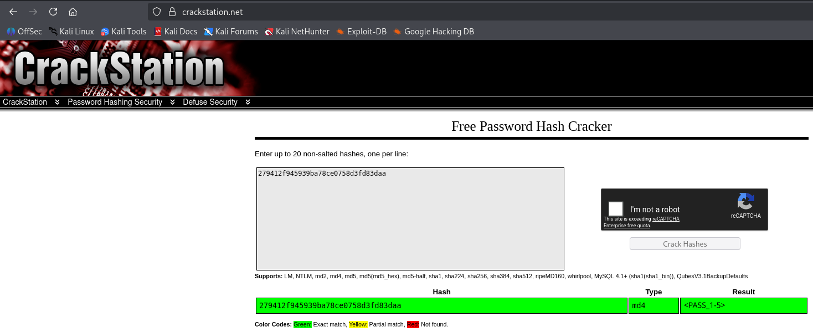

# [Crack the hash](https://tryhackme.com/room/crackthehash)

<a href="https://tryhackme.com/room/crackthehash"><figure></figure></a>

> Cracking hashes challenges

Original Capture The Flag available on [Try Hack Me](https://tryhackme.com/room/crackthehash), made by [ben](https://tryhackme.com/p/ben).

Dificulty: `Easy`

Solved in: `2026/04/11`

# Table of Contents

- [Crack the hash](#crack-the-hash)
- [Table of Contents](#table-of-contents)
- [Writeup](#writeup)
   * [Summary](#summary)
   * [Hash Cracking](#hash-cracking)
      + [Hash 1-1](#hash-1-1)
      + [Hash 1-2](#hash-1-2)
      + [Hash 1-3](#hash-1-3)
      + [Hash 1-4](#hash-1-4)
      + [Hash 1-5](#hash-1-5)
      + [Hash ](#hash-2-1)
      + [Hash 2-2](#hash-2-2)
      + [Hash 2-3](#hash-2-3)
      + [Hash ](#hash-2-4)

# Writeup

## Summary

Crack the hash consists in, as it says in the title, break the available hashes.

## Hash Cracking

For this CTF, the objective consists solely on breaking hashes, without virtual machines or other pentest subjects. Each task is "obtain the original value from the hash".

In general, the solution steps will be the same for all tasks (except where specified): first I'll use `hashid`[^hashid] or [hash-analyzer](https://www.tunnelsup.com/hash-analyzer/) to identify what hash is it, then use `hashcat`[^hashcat] or [crackstation](https://crackstation.net/) for actually breaking the hash.

The command I'll use with `hashcat` uses the rockme[^rockme] wordlist:
- `hashcat -a 0 -m <hashtype> '<hash>' /usr/share/wordlists/rockyou.txt.gz`

### Hash 1-1

Given hash: ``

```bash
$ hashid 48bb6e862e54f2a795ffc4e541caed4d
Analyzing '48bb6e862e54f2a795ffc4e541caed4d'
[+] MD2 
[+] MD5 
[+] MD4 
[+] Double MD5 
# ...
```

Trying it out with `MD5`:

```bash
$ hashcat -a 0 -m 0 48bb6e862e54f2a795ffc4e541caed4d /usr/share/wordlists/rockyou.txt.gz
# ...
48bb6e862e54f2a795ffc4e541caed4d:<PASS_1-1>
                                                          
Session..........: hashcat
Status...........: Cracked
Hash.Mode........: 0 (MD5)
Hash.Target......: 48bb6e862e54f2a795ffc4e541caed4d
# ...
Started: Sat Apr 11 11:17:33 2026
Stopped: Sat Apr 11 11:17:55 2026
```

Found the password, <PASS_1-1>.

### Hash 1-2

Given hash: `CBFDAC6008F9CAB4083784CBD1874F76618D2A97`

```bash
$ hashid CBFDAC6008F9CAB4083784CBD1874F76618D2A97
Analyzing 'CBFDAC6008F9CAB4083784CBD1874F76618D2A97'
[+] SHA-1 
[+] Double SHA-1 
# ...
```

Trying it out with `SHA1`:

```bash
$ hashcat -a 0 -m 100 CBFDAC6008F9CAB4083784CBD1874F76618D2A97 /usr/share/wordlists/rockyou.txt.gz 
# ...
cbfdac6008f9cab4083784cbd1874f76618d2a97:<PASS_1-2>      
                                                          
Session..........: hashcat
Status...........: Cracked
Hash.Mode........: 100 (SHA1)
Hash.Target......: cbfdac6008f9cab4083784cbd1874f76618d2a97
#...
Started: Sat Apr 11 11:27:45 2026
Stopped: Sat Apr 11 11:27:56 2026
```

Found the password, <PASS_1-2>.

### Hash 1-3

Given hash: `1C8BFE8F801D79745C4631D09FFF36C82AA37FC4CCE4FC946683D7B336B63032`

```bash
$ hashid 1C8BFE8F801D79745C4631D09FFF36C82AA37FC4CCE4FC946683D7B336B63032
Analyzing '1C8BFE8F801D79745C4631D09FFF36C82AA37FC4CCE4FC946683D7B336B63032'
[+] Snefru-256 
[+] SHA-256 
[+] RIPEMD-256 
[+] Haval-256 
# ...
[+] SHA3-256 
# ...
```

Trying it out with `SHA2-256`:

```bash
$ hashcat -a 0 -m 1400 1C8BFE8F801D79745C4631D09FFF36C82AA37FC4CCE4FC946683D7B336B63032 /usr/share/wordlists/rockyou.txt.gz
# ...
1c8bfe8f801d79745c4631d09fff36c82aa37fc4cce4fc946683d7b336b63032:<PASS_1-3>
                                                     
Session..........: hashcat
Status...........: Cracked
Hash.Mode........: 1400 (SHA2-256)
Hash.Target......: 1c8bfe8f801d79745c4631d09fff36c82aa37fc4cce4fc94668...b63032
# ...
Started: Sat Apr 11 11:33:23 2026
Stopped: Sat Apr 11 11:33:35 2026
```

Found the password, <PASS_1-3>.

### Hash 1-4

Given hash: `$2y$12$Dwt1BZj6pcyc3Dy1FWZ5ieeUznr71EeNkJkUlypTsgbX1H68wsRom`

```bash
$ hashid '$2y$12$Dwt1BZj6pcyc3Dy1FWZ5ieeUznr71EeNkJkUlypTsgbX1H68wsRom'
Analyzing '$2y$12$Dwt1BZj6pcyc3Dy1FWZ5ieeUznr71EeNkJkUlypTsgbX1H68wsRom'
[+] Blowfish(OpenBSD) 
[+] Woltlab Burning Board 4.x 
[+] bcrypt
```

When I tried cracking the `bcrypt` / `Blowfish` hash, the estimated time was two days, since it is a slower-to-crack hash. I decided, so, to use other informations to restrict the wordlist.

The biggest restriction available is, then, the amount of characters in the password. The text field on Try Hack Me provides that it has 4 characters, so I filtered rockme[^rockme].

For that, all I need is to (after decompressing `rockyou.txt.gz` with `gzip`[^gzip]) filter words with size 4 using `awk`[^awk]:

```bash
$ gzip -d rockyou.txt.gz 
$ awk 'length($0) == 4' rockyou.txt > pass4.txt
```

Now, with the new wordlist, the result quickly comes:

```bash
$ hashcat -a 0 -m 3200 '$2y$12$Dwt1BZj6pcyc3Dy1FWZ5ieeUznr71EeNkJkUlypTsgbX1H68wsRom' ~/Desktop/pass4.txt
# ...
$2y$12$Dwt1BZj6pcyc3Dy1FWZ5ieeUznr71EeNkJkUlypTsgbX1H68wsRom:<PASS_1-4>
                                                          
Session..........: hashcat
Status...........: Cracked
Hash.Mode........: 3200 (bcrypt $2*$, Blowfish (Unix))
Hash.Target......: $2y$12$Dwt1BZj6pcyc3Dy1FWZ5ieeUznr71EeNkJkUlypTsgbX...8wsRom
# ...
Started: Sat Apr 11 12:20:14 2026
Stopped: Sat Apr 11 12:20:31 2026
```

Found the password, <PASS_1-4>.

### Hash 1-5

Given hash: `279412f945939ba78ce0758d3fd83daa`

```bash
Analyzing '279412f945939ba78ce0758d3fd83daa'
[+] MD2 
[+] MD5 
[+] MD4 
[+] Double MD5
# ...
```

Trying it as `MD5`, the list exhausted, and so it did with `MD4`. I tried exchanging `hashcat` for another tool, [crackstation](https://crackstation.net/), and the result came quick:

<figure></figure>

Found the password, <PASS_1-5>.

### Hash 2-1

Given hash: `F09EDCB1FCEFC6DFB23DC3505A882655FF77375ED8AA2D1C13F640FCCC2D0C85`

```bash
$ hashid F09EDCB1FCEFC6DFB23DC3505A882655FF77375ED8AA2D1C13F640FCCC2D0C85
Analyzing 'F09EDCB1FCEFC6DFB23DC3505A882655FF77375ED8AA2D1C13F640FCCC2D0C85'
[+] Snefru-256 
[+] SHA-256 
[+] RIPEMD-256 
[+] Haval-256 
# ...
[+] SHA3-256 
[+] Skein-256 
[+] Skein-512(256) 
```

Trying it out with `SHA2-256`:

```bash
$ hashcat -a 0 -m 1400 'F09EDCB1FCEFC6DFB23DC3505A882655FF77375ED8AA2D1C13F640FCCC2D0C85'  /usr/share/wordlists/rockyou.txt.gz
# ...
f09edcb1fcefc6dfb23dc3505a882655ff77375ed8aa2d1c13f640fccc2d0c85:<PASS_2-1>
                                                          
Session..........: hashcat
Status...........: Cracked
Hash.Mode........: 1400 (SHA2-256)
Hash.Target......: f09edcb1fcefc6dfb23dc3505a882655ff77375ed8aa2d1c13f...2d0c85
# ...
Started: Sat Apr 11 13:18:22 2026
Stopped: Sat Apr 11 13:18:24 2026
```

Found the password, <PASS_2-1>.

### Hash 2-2

Given hash: `1DFECA0C002AE40B8619ECF94819CC1B`

```bash
$ hashid 1DFECA0C002AE40B8619ECF94819CC1B                                
Analyzing '1DFECA0C002AE40B8619ECF94819CC1B'
[+] MD2 
[+] MD5 
[+] MD4 
[+] Double MD5 
[+] LM 
# ...
[+] NTLM 
# ...
```

Trying it out with `MD5`:

```bash
$ hashcat -a 0 -m 0 '1DFECA0C002AE40B8619ECF94819CC1B'  /usr/share/wordlists/rockyou.txt.gz
# ...
Session..........: hashcat                                
Status...........: Exhausted
Hash.Mode........: 0 (MD5)
Hash.Target......: 1dfeca0c002ae40b8619ecf94819cc1b
# ...
Started: Sat Apr 11 13:21:34 2026
Stopped: Sat Apr 11 13:21:38 2026
```

Exhausted. The result is similar with `MD4`:

```bash
$ hashcat -a 0 -m 900 '1DFECA0C002AE40B8619ECF94819CC1B'  /usr/share/wordlists/rockyou.txt.gz
# ...
Session..........: hashcat                                
Status...........: Exhausted
Hash.Mode........: 900 (MD4)
Hash.Target......: 1dfeca0c002ae40b8619ecf94819cc1b
# ...
Started: Sat Apr 11 13:22:03 2026
Stopped: Sat Apr 11 13:22:06 2026
```

But trying `NTLM`:

```bash
$ hashcat -a 0 -m 1000 '1DFECA0C002AE40B8619ECF94819CC1B'  /usr/share/wordlists/rockyou.txt.gz
# ...
1dfeca0c002ae40b8619ecf94819cc1b:<PASS_2-2>             
                                                          
Session..........: hashcat
Status...........: Cracked
Hash.Mode........: 1000 (NTLM)
Hash.Target......: 1dfeca0c002ae40b8619ecf94819cc1b
# ...
Started: Sat Apr 11 13:27:06 2026
Stopped: Sat Apr 11 13:27:17 2026
```

Found the password, <PASS_2-2>.

### Hash 2-3

Given hash: `$6$aReallyHardSalt$6WKUTqzq.UQQmrm0p/T7MPpMbGNnzXPMAXi4bJMl9be.cfi3/qxIf.hsGpS41BqMhSrHVXgMpdjS6xeKZAs02.`

```bash
$ hashid '$6$aReallyHardSalt$6WKUTqzq.UQQmrm0p/T7MPpMbGNnzXPMAXi4bJMl9be.cfi3/qxIf.hsGpS41BqMhSrHVXgMpdjS6xeKZAs02.'
Analyzing '$6$aReallyHardSalt$6WKUTqzq.UQQmrm0p/T7MPpMbGNnzXPMAXi4bJMl9be.cfi3/qxIf.hsGpS41BqMhSrHVXgMpdjS6xeKZAs02.'
[+] SHA-512 Crypt
```

Since the only result is `sha512crypt`:

```bash
$ hashcat -a 0 -m 1800 '$6$aReallyHardSalt$6WKUTqzq.UQQmrm0p/T7MPpMbGNnzXPMAXi4bJMl9be.cfi3/qxIf.hsGpS41BqMhSrHVXgMpdjS6xeKZAs02.'  /usr/share/wordlists/rockyou.txt.gz
# ...
$6$aReallyHardSalt$6WKUTqzq.UQQmrm0p/T7MPpMbGNnzXPMAXi4bJMl9be.cfi3/qxIf.hsGpS41BqMhSrHVXgMpdjS6xeKZAs02.:<PASS_2-3>
                                                          
Session..........: hashcat
Status...........: Cracked
Hash.Mode........: 1800 (sha512crypt $6$, SHA512 (Unix))
Hash.Target......: $6$aReallyHardSalt$6WKUTqzq.UQQmrm0p/T7MPpMbGNnzXPM...ZAs02.
# ...
Started: Sat Apr 11 13:41:13 2026
Stopped: Sat Apr 11 13:49:35 2026
```

Found the password, <PASS_2-3>. Notably, this was the longest time of thhe challenge for a crack.

### Hash 2-4

Given hash: `e5d8870e5bdd26602cab8dbe07a942c8669e56d6`
Given salt: `tryhackme`

```bash
$ hashid e5d8870e5bdd26602cab8dbe07a942c8669e56d6:tryhackme
Analyzing 'e5d8870e5bdd26602cab8dbe07a942c8669e56d6:tryhackme'
[+] SHA-1 
[+] Double SHA-1
# ...
```

The hash format really is similar to `SHA-1`, though since a salt is provided it's still needed to figure out which kind of salt was used. By trial and error, I attempted all available methods on `hashcat`, using `e5d8870e5bdd26602cab8dbe07a942c8669e56d6:tryhackme` as the hash:

Trying it out first with `sha1($pass.$salt)`:

```bash
$ hashcat -a 0 -m 110 'e5d8870e5bdd26602cab8dbe07a942c8669e56d6:tryhackme'  /usr/share/wordlists/rockyou.txt.gz 
# ...
Session..........: hashcat                                
Status...........: Exhausted
Hash.Mode........: 110 (sha1($pass.$salt))
Hash.Target......: e5d8870e5bdd26602cab8dbe07a942c8669e56d6:tryhackme
# ...
Started: Sat Apr 11 13:55:35 2026
Stopped: Sat Apr 11 13:55:47 2026
```

With `sha1($salt.$pass)`:

```bash
hashcat -a 0 -m 120 'e5d8870e5bdd26602cab8dbe07a942c8669e56d6:tryhackme'  /usr/share/wordlists/rockyou.txt.gz 
# ...
Session..........: hashcat                                
Status...........: Exhausted
Hash.Mode........: 120 (sha1($salt.$pass))
Hash.Target......: e5d8870e5bdd26602cab8dbe07a942c8669e56d6:tryhackme
# ...
Started: Sat Apr 11 14:00:29 2026
Stopped: Sat Apr 11 14:00:41 2026
```

With `HMAC-SHA1 (key = $pass)`:

```bash
$ hashcat -a 0 -m 150 'e5d8870e5bdd26602cab8dbe07a942c8669e56d6:tryhackme'  /usr/share/wordlists/rockyou.txt.gz 
# ...
Session..........: hashcat                                
Status...........: Exhausted
Hash.Mode........: 150 (HMAC-SHA1 (key = $pass))
Hash.Target......: e5d8870e5bdd26602cab8dbe07a942c8669e56d6:tryhackme
# ...
Started: Sat Apr 11 14:01:40 2026
Stopped: Sat Apr 11 14:01:54 2026
```

And, finally, with `HMAC-SHA1 (key = $salt)`:

```bash
$ hashcat -a 0 -m 160 'e5d8870e5bdd26602cab8dbe07a942c8669e56d6:tryhackme'  /usr/share/wordlists/rockyou.txt.gz 
# ...
e5d8870e5bdd26602cab8dbe07a942c8669e56d6:tryhackme:<PASS_2-4>
                                                          
Session..........: hashcat
Status...........: Cracked
Hash.Mode........: 160 (HMAC-SHA1 (key = $salt))
Hash.Target......: e5d8870e5bdd26602cab8dbe07a942c8669e56d6:tryhackme
# ...
Started: Sat Apr 11 14:02:36 2026
Stopped: Sat Apr 11 14:02:50 2026
```

Found the password, <PASS_2-4>.


[^hashid]: https://psypanda.github.io/hashID/
[^hashcat]: https://hashcat.net/hashcat/
[^rockme]: https://weakpass.com/wordlists/rockyou.txt
[^gzip]: https://www.gzip.org/
[^awk]: https://en.wikipedia.org/wiki/AWK